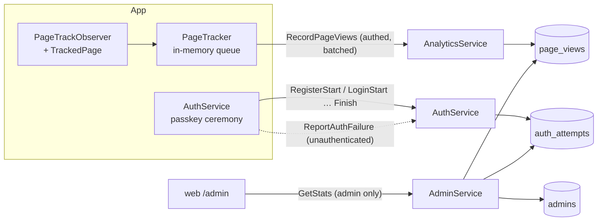

# Analytics and the Stats Page

First-party usage tracking: which screens a signed-in user opened and for how
long, and whether passkey sign-ins succeed. Rows live in our own SQLite and go
nowhere else — there is no third-party SDK. The read side is an admin-only page
on the website, `/admin`.



## Page views

### How a page gets tracked

`app/lib/services/page_tracker.dart`. In order of preference:

| Kind of page | What to do | Name recorded |
|---|---|---|
| A `GoRoute` in `main.dart` | Nothing. `PageTrackObserver` is on the router and the `ShellRoute`. | The path template: `/settings`, `/exercise/:ex` |
| An imperative route or a bottom sheet | Pass `settings: RouteSettings(name: 'science')` / `routeSettings:` | That name. Sheets use `sheet/<slug>` |
| A step inside one screen | Wrap it in `TrackedPage(name: …)`, or call `PageTracker.instance.enter(…)` | `onboarding/2-unit`, `tutorial/03-home_add` |

Unnamed routes — every dialog — are ignored, and their time counts toward the
page underneath. A page name is a stable slug: never a concrete id, never user
text, never copy (tutorial steps are named by position and target id, because
the copy gets rewritten). Step slugs are zero-padded or numbered so the stats
page sorts them into a funnel.

The workout screen is deliberately not instrumented beyond its route (`/`).

### Timing, queueing, upload

- Time on page is foreground time from a `Stopwatch`. Backgrounding the app
  closes the current view and resuming opens a fresh one, so a phone in a
  pocket does not count.
- A page passed through in under 250 ms (a redirect, a screen that hands
  straight to its first step) is dropped.
- Views queue in memory and upload when 20 have built up, 30 s after the first
  one queued, and on backgrounding. The queue caps at 500 and is lost if the
  app is killed — this is telemetry, not data.
- **Views seen before login are held until a session exists**, then uploaded
  under the account that signed in. That is how the login → onboarding →
  tutorial funnel is captured with every write still authenticated. Someone
  who never manages to sign in is invisible here; see *Sign-in attempts*.
- On logout the queue is cleared so one account's views are never uploaded
  under the next.
- Each view carries `(app_session_id, seq)`. The server's primary key is
  `(user_id, app_session_id, seq)` with `INSERT OR IGNORE`, so a retried batch
  cannot double count.
- An old backend answers `UNIMPLEMENTED`; the tracker then stops trying until
  the next launch. No version gate is involved in either direction.
- Until `PageTracker.attach` is called (it is called in `main.dart`) the
  tracker follows pages but never starts a timer or touches the network, so
  widget tests that pump a screen stay quiet.

The server (`src/server/analytics.rs`) drops rather than rejects anything
malformed: a page that is not a slug, a clock more than a day ahead or 30 days
behind, more than 200 views in a batch. Durations are clamped to 6 h. Platform
and app version come from the `x-platform` / `x-app-version` request metadata.

## Sign-in attempts

Passkeys are the only way in, so a broken passkey flow on some device is the
failure that matters most and the one page views cannot see. The server
already sees both halves of every ceremony, so `auth_attempts` gets a row on
each `RegisterStart` / `LoginStart` (keyed by the pre-allocated user id or the
challenge id) and the matching `Finish` stamps it `ok` or `rejected`.

**A row still `started` ten minutes later is a ceremony that died on the
device.** To learn why, the app wraps the on-device half of the ceremony
(`_reportingDeviceFailure` in `auth_service.dart`), classifies the exception
into `AuthFailureReason`, and calls `ReportAuthFailure`.

`ReportAuthFailure` is **unauthenticated on purpose** — its caller is someone
who could not sign in. It is the second deliberate exception to "every handler
calls `authed_user_id`" (the other is `list_template_library`); do not copy it.
What keeps it safe:

- It cannot create a row. It is a single `UPDATE … WHERE attempt_id = ? AND
  outcome = 'started' AND started_at >= now - 1h`.
- So it only lands on an attempt the server itself issued, once, and never
  rewrites a verdict the server reached.
- The reason is an enum, never free text. The response does not reveal whether
  it landed.

No username is stored on an attempt. A successful registration's row is keyed
by the new user's id and is removed with the account.

## Admins and the stats page

`AdminService.GetStats` is gated by `authed_admin_id` (`src/server/support.rs`),
which, like `authed_user_id`, is called explicitly at the top of the handler.
`GetAdminStatus` only tells the website whether to show the "Stats" link.

Admins are granted **by username but stored by user id**:

```sh
# on the host, from the service's working directory, as the service user
./current/schlift admin add brensch
./current/schlift admin list
./current/schlift admin remove brensch
```

The command opens the same `DATA_DIR` and is safe to run beside the live
server. Two properties matter, and `admin_follows_the_account_not_the_name`
tests both:

- `admin add` fails for a name nobody holds. A grant can never sit waiting for
  whoever registers that name first.
- Deleting an account deletes its `admins` row. The freed username can be
  re-registered, but the new account has a new user id and no rights.

Usernames themselves cannot collide or be changed: `users_current.username_ci`
is `UNIQUE` on the trimmed, lowercased name, and no RPC renames a user.

`/admin?user=<name>` opens directly on that user's trail.

## Retention and deletion

Nothing expires: analytics rows are kept until the account is deleted, which is
what the privacy policy promises. `page_views` and `admins` are covered by
`delete_user_account_and_data` and by its discover-every-`user_id`-table test;
a successful registration's `auth_attempts` row goes with the account too.
Attempts that never became an account carry no username and stay.

`GetStats` aggregates at most `MAX_STATS_WINDOW_DAYS` (365) at a time. That is a
query-cost bound, not retention: `page_stats` reads every row in the window to
compute medians.

## Disclosure

Collecting this is declared in three places, which must stay in step with the
code: the "Usage data" and "Security data" bullets in
`web/src/pages/privacy.tsx`; Play Console → App content → Data safety ("App
interactions": collected, not shared); App Store Connect → App Privacy ("Usage
Data → Product Interaction", linked to identity, not used for tracking). The
two console forms are manual and are not tracked in this repo.
