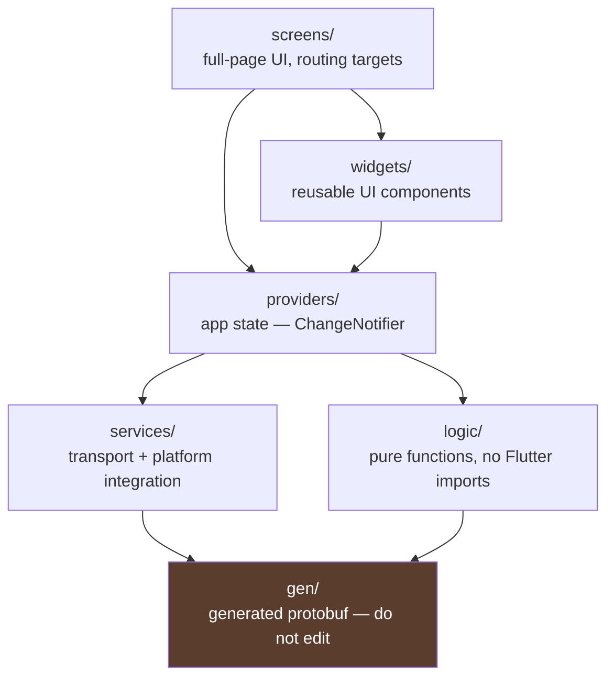
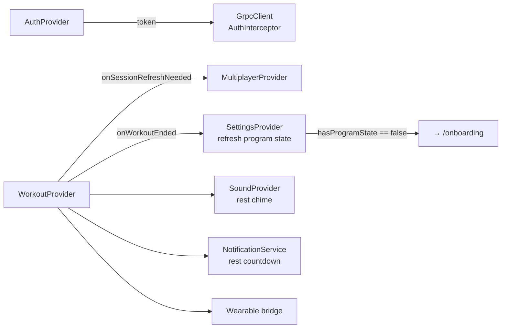
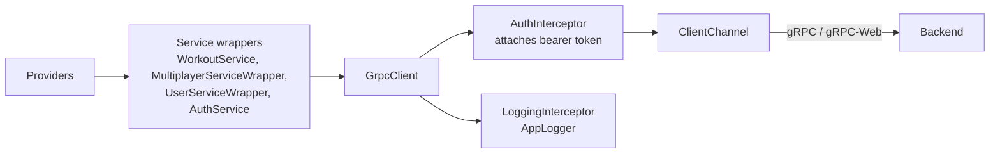
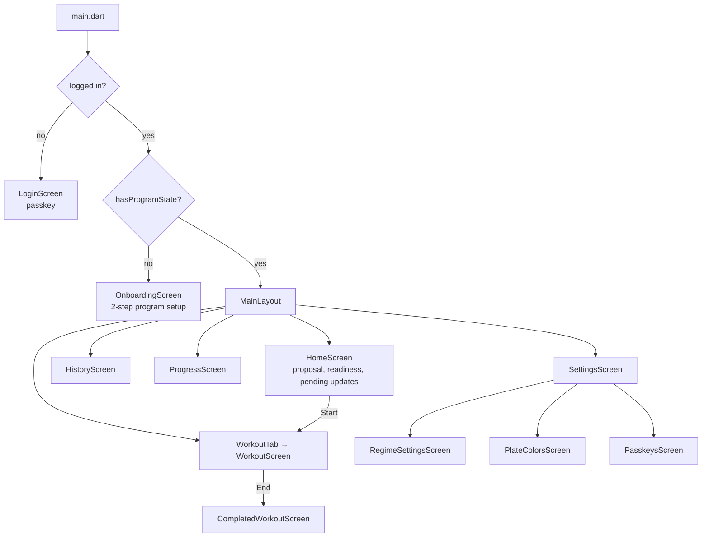

# Flutter App

`app/lib/` is a Provider-based Flutter app targeting iOS and Android, with
companion apps for Wear OS and Apple Watch.

## Layers



The rule that matters: **`logic/` must not import Flutter**. It is pure Dart, so
it is testable without a widget harness. Everything genuinely algorithmic —
warmup generation, plate maths, unit conversion, exercise grouping — belongs
there.

## Providers

Registered in `app/lib/main.dart`, which also wires the cross-provider callbacks.

| Provider | Owns | Notes |
|---|---|---|
| `AuthProvider` | Session token, user id, profile | Gates the whole app |
| `WorkoutProvider` | The active workout | 1,929 lines — the centre of gravity |
| `MultiplayerProvider` | Session + participants | Polls at 1 Hz |
| `SettingsProvider` | Plate colours, weight unit, program state | Drives onboarding redirect |
| `ThemeProvider` | Light/dark | Persisted locally |
| `SoundProvider` | Rest-timer sound preset | |



These callbacks are assigned in `main.dart` rather than injected, so providers
don't depend on each other's types. It keeps coupling loose but means the wiring
is invisible from the provider source — check `main.dart` when tracing a
cross-provider effect.

### WorkoutProvider

Holds the local `ActiveWorkout` and applies optimistic mutations before the
server confirms them — see
[workout-lifecycle.md](workout-lifecycle.md#optimistic-mutations).

Responsibilities currently bundled into this one class:

- Local workout state + derived caches (`_refreshDerivedState`,
  `_rebuildExerciseGroupsCache`, `_sortState`)
- Optimistic mutation application and server reconciliation
- gRPC calls for every workout RPC
- Rest timer ticking and rest-complete sound
- App lifecycle observation (`WidgetsBindingObserver`) for backgrounding
- Wearable snapshot publishing

That is several distinct concerns in one file; see
[the split plan](#known-structural-issues).

## Transport



`GrpcClient` handles connection recovery: on `DEADLINE_EXCEEDED` or `UNAVAILABLE`
it resets the channel and retries **once**. Other gRPC errors propagate
untouched. This is the one part of the app with real test coverage
(`app/test/grpc_recovery_test.dart`).

## Screens and routing



`OnboardingScreen` renders itself from the regime's `state_schema()` — fields
marked `onboarding_field = true` become inputs. Adding a config field to a regime
therefore needs no Flutter change. See [regimes.md](regimes.md).

## Health and sensors

`HealthService` requests **all** HealthKit / Health Connect permissions in a
single comprehensive request, once.

> Do not add a second `requestAuthorization` path. iOS shows the permission
> sheet once per permission set; a second partial request produces a sheet the
> user has no reason to expect and can silently fail. `_workoutHealthPermissionsRequested`
> and `_healthPermissionRequestInFlight` guard against re-entry.

Calorie estimation uses a MET-based formula (`_strengthTrainingMet = 3.5`) with a
flat `_fallbackKcalPerMin = 5.0` when body weight is unknown. Derivation is in
[`docs/calorie_maths.md`](../calorie_maths.md).

## Known structural issues

Seven files exceed 1,300 lines:

| File | Lines | Problem |
|---|---|---|
| `screens/onboarding_screen.dart` | 2,067 | 20 private widget classes in one file |
| `screens/home_screen.dart` | 1,986 | screen + 10 widgets + selection model |
| `widgets/workout_modals.dart` | 1,943 | 14 unrelated modals |
| `providers/workout_provider.dart` | 1,929 | transport + mutation + lifecycle + rest timer |
| `widgets/heart_rate_chart.dart` | 1,459 | chart + painter + zone maths |
| `screens/workout_screen.dart` | 1,437 | screen + 18 private widgets |
| `widgets/workout_bottom_bar.dart` | 1,393 | bar + 10 animation widgets |

The recurring pattern is a public widget followed by a long tail of private
`_Foo` widgets. The fix is a folder per screen with one file per widget, which
is mechanical and safe.

### Duplicated logic

`app/lib/logic/warmup.dart` is a line-for-line port of
`src/workout/planning.rs` — `_roundTo2_5`/`round_to_2_5`,
`_is25_45PlateCombo`/`is_25_45_plate_combo`,
`_snapWarmupWeight`/`snap_warmup_weight`. Two implementations of fiddly
plate-snapping that must agree exactly. They are pinned together by a shared
golden fixture; if you change one, change both and update the fixture.

## Testing

Existing coverage is thin:

- `test/grpc_recovery_test.dart` — channel reset/retry behaviour
- `test/widget_test.dart` — a placeholder plus one error-formatting test

`logic/` is pure Dart and should carry the bulk of unit tests. Widget tests are
most valuable for `WorkoutProvider`'s optimistic mutation path, where a
divergence from the Rust reducer causes visible UI flicker.

```bash
cd app && flutter test
flutter analyze
```
