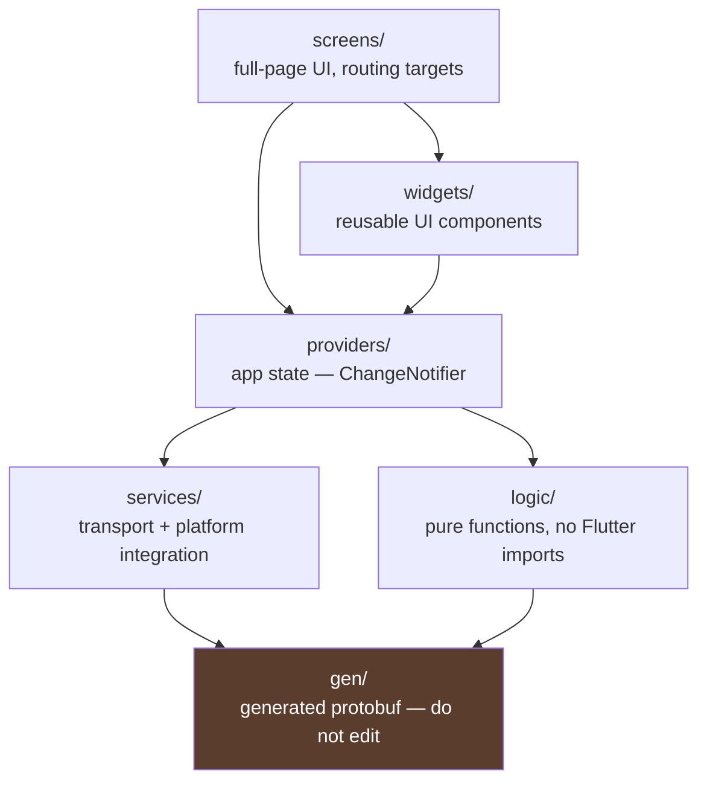
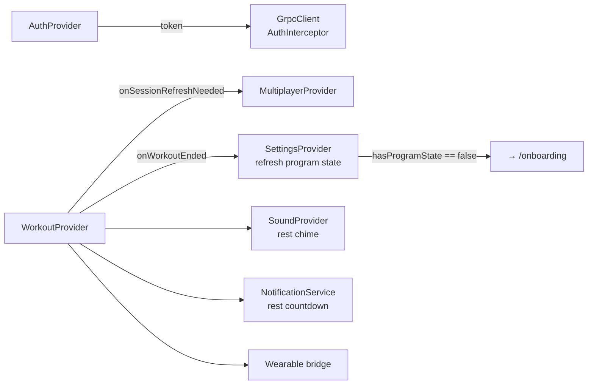
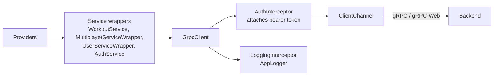
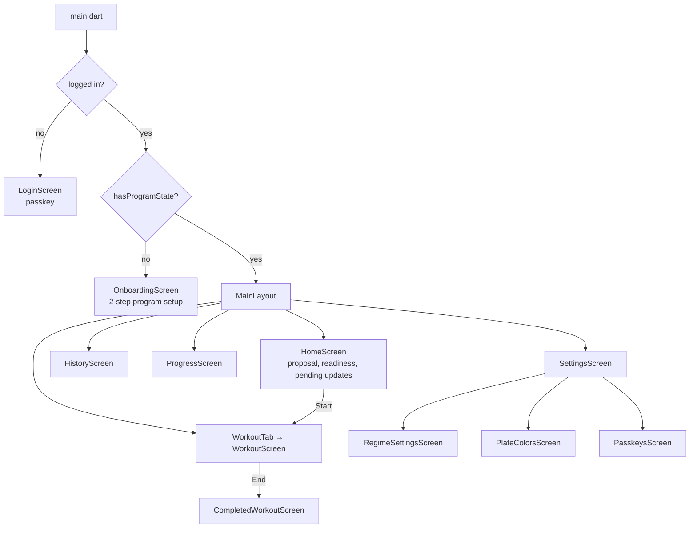

# Flutter App

`app/lib/` is a Provider-based Flutter app targeting iOS and Android, with
companion apps for Wear OS and Apple Watch.

## Layers



The rule that matters: **`logic/` must not import Flutter**. It is pure Dart, so
it is testable without a widget harness. Everything genuinely algorithmic —
warmup generation, plate maths, unit conversion, exercise grouping — belongs
there.

## Providers

Registered in `app/lib/main.dart`, which also wires the cross-provider callbacks.

| Provider | Owns | Notes |
|---|---|---|
| `AuthProvider` | Session token, user id, profile | Gates the whole app |
| `WorkoutProvider` | The active workout | The centre of gravity; pure logic lives in `logic/` |
| `MultiplayerProvider` | Session + participants | Polls at 1 Hz |
| `SettingsProvider` | Plate colours, weight unit, program state | Drives onboarding redirect |
| `ThemeProvider` | Light/dark | Persisted locally |
| `SoundProvider` | Rest-timer sound preset | |



These callbacks are assigned in `main.dart` rather than injected, so providers
don't depend on each other's types. It keeps coupling loose but means the wiring
is invisible from the provider source — check `main.dart` when tracing a
cross-provider effect.

### WorkoutProvider

Holds the local `ActiveWorkout` and applies optimistic mutations before the
server confirms them — see
[workout-lifecycle.md](workout-lifecycle.md#optimistic-mutations).

The provider orchestrates: derived caches, server reconciliation, the rest
timer, lifecycle observation and wearable snapshot publishing. The pure parts —
plan building and the optimistic set transitions — live in
`logic/workout_plan_builder.dart` and `logic/workout_reducer.dart`, where they
are unit-tested against the Rust mirrors (see
[Mirrors of the backend](#mirrors-of-the-backend)).

## Transport



`GrpcClient` handles connection recovery: on `DEADLINE_EXCEEDED` or `UNAVAILABLE`
it resets the channel and retries **once**. Other gRPC errors propagate
untouched. This is the one part of the app with real test coverage
(`app/test/grpc_recovery_test.dart`).

## Screens and routing



`OnboardingScreen` renders itself from the regime's `state_schema()` — fields
marked `onboarding_field = true` become inputs. Adding a config field to a regime
therefore needs no Flutter change. See [regimes.md](regimes.md).

## Health and sensors

`HealthService` requests **all** HealthKit / Health Connect permissions in a
single comprehensive request, once.

> Do not add a second `requestAuthorization` path. iOS shows the permission
> sheet once per permission set; a second partial request produces a sheet the
> user has no reason to expect and can silently fail. `_workoutHealthPermissionsRequested`
> and `_healthPermissionRequestInFlight` guard against re-entry.

Calorie estimation uses a MET-based formula (`_strengthTrainingMet = 3.5`) with a
flat `_fallbackKcalPerMin = 5.0` when body weight is unknown. Derivation is in
[`docs/calorie_maths.md`](../calorie_maths.md).

## Component layout

Screens with real surface area are folders, one component per file, all public:

```
screens/home/          home_screen, home_selection (model), readiness_banner,
                       group_grid, exercise_config_details
screens/onboarding/    onboarding_screen + steps/ (one file per step)
                       + widgets/ (form fields, cards, profile marker)
screens/workout/       workout_screen, current_exercise_card,
                       exercise_list_card, exschplanation_page, workout_panels
widgets/workout_bar/   workout_bottom_bar, bar_controls, session_cards
widgets/heart_rate/    heart_rate_chart, models (zones/viewport — pure),
                       zone_summary, trend_painter, legend
widgets/exercise_editor/  add/edit dialogs, chip selector, per-exercise
                       config, group settings
widgets/dialogs/       end-workout, participant viewer, health dialogs
widgets/common/        section_header, weight_picker, rainbow_shimmer_text,
                       horizontal_shaker — generic, screen-agnostic
```

The rule of thumb: a widget goes in `widgets/common/` only when nothing about
it is specific to one screen; otherwise it lives with its screen.

### Mirrors of the backend

Three `logic/` modules are client-side mirrors of Rust code and must stay in
lockstep with it:

| Dart | Rust | Pinned by |
|---|---|---|
| `logic/warmup.dart` | `workout/planning.rs` warmups | `testdata/warmup_golden.json`, both suites |
| `logic/workout_plan_builder.dart` | `workout/planning.rs` set generation | shares `warmup.dart`'s golden fixture |
| `logic/workout_reducer.dart` | `workout/reducer.rs` | mirrored test suites on each side |

### Duplicated logic

`app/lib/logic/warmup.dart` is a line-for-line port of the warmup maths in
`src/workout/planning.rs` — plate snapping that must agree exactly. The golden
fixture pins them together; if you change one, change both and regenerate.

## Testing

- `test/logic/` — the bulk of coverage: warmup golden parity with the backend,
  the optimistic workout reducer (mirroring the Rust reducer suite), plate
  calculator invariants, weight-unit conversion and snapping
- `test/grpc_recovery_test.dart` — channel reset/retry behaviour

`logic/` is pure Dart, so it carries unit tests without a widget harness. See
[testing.md](testing.md) for the full picture and the remaining gaps.

```bash
cd app && flutter test
flutter analyze
```
