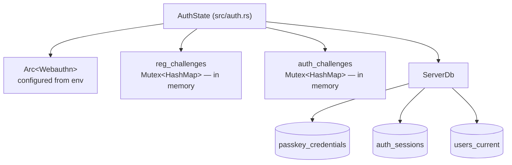
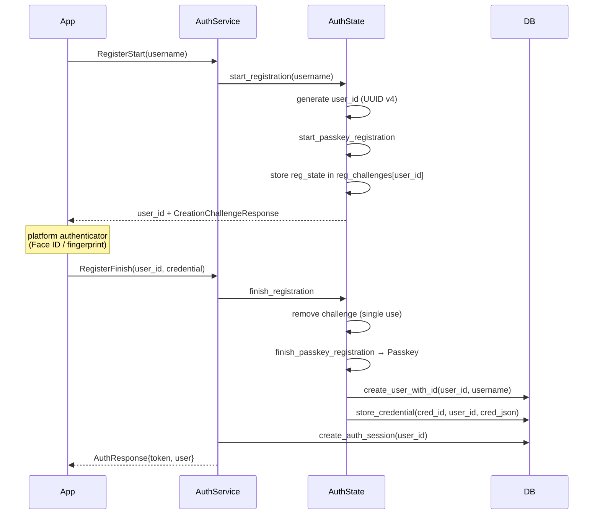
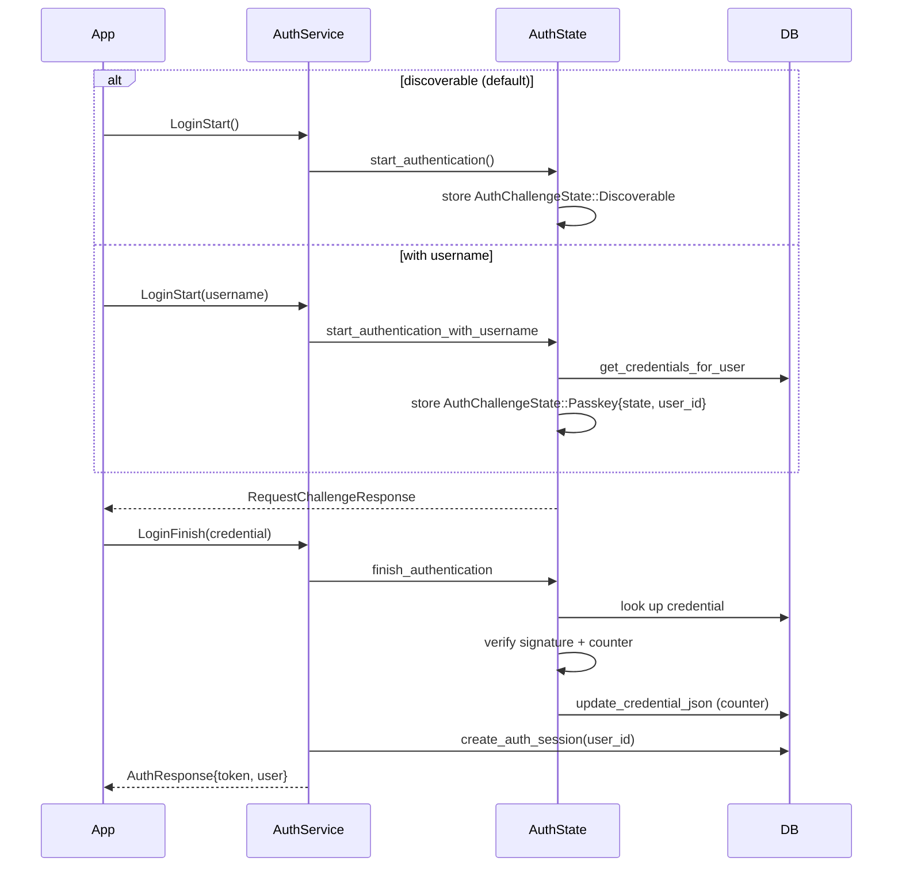
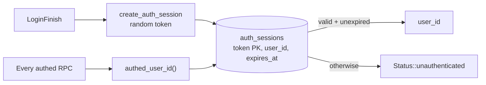

# Authentication

Schlift uses **passkeys (WebAuthn) only**. There are no passwords, no email, and
no password reset flow. `webauthn-rs` handles the protocol; `src/auth.rs` holds
the state and `src/server/auth.rs` exposes the RPCs.

## Pieces



Configuration comes from environment variables, read once at construction:

| Variable | Purpose | Default |
|---|---|---|
| `WEBAUTHN_RP_ID` | Relying party id (the domain) | `localhost` |
| `WEBAUTHN_RP_ORIGIN` | Expected origin | `http://localhost:5173` |
| `WEBAUTHN_ANDROID_ORIGINS` | Comma-separated `android:apk-key-hash:…` origins | — |
| `WEBAUTHN_ANDROID_ORIGIN` | Single-origin fallback | — |

Android apps present an APK-signing-key-hash origin rather than a URL, so every
signing key that ships (debug, upload, Play signing) needs its hash listed or
login fails on that build. Hashes are printed by `make print-cert-hashes`.

> These are `expect()`ed at startup — a malformed origin **panics the server on
> boot** rather than degrading. That is deliberate: a misconfigured RP silently
> accepting the wrong origin would be worse.

## Registration



Note the ordering: **the user row is created in `finish_registration`, not
`start`**. An abandoned registration leaves nothing behind except an in-memory
challenge that expires.

Challenges are single-use — `finish` removes the entry before verifying, so a
replayed `RegisterFinish` finds no challenge.

## Login

Two paths. Discoverable (usernameless) is the default; the username path exists
for authenticators that need a credential hint.



`AuthChallengeState` is an enum over the two flows so a single challenge map can
serve both. The signature counter is written back on every successful login —
`webauthn-rs` uses it to detect cloned authenticators.

## Sessions



The token is a bearer token in gRPC metadata, attached client-side by
`AuthInterceptor` (`app/lib/services/grpc_client.dart`).

`authed_user_id` is called **explicitly at the top of each handler** — there is
no interceptor or middleware enforcing it. A new handler that omits the call is
unauthenticated, and nothing will flag that. Copy an existing handler when adding
one.

`Logout` deletes the row. `DeleteAccount` deletes the user and all their data
(`delete_user_account_and_data`, `src/db/auth.rs`).

## Challenge lifetime

Pending challenges live in process memory with a 300-second TTL
(`CHALLENGE_TTL_SECS`). Expired entries are swept lazily on the next
`start_registration` / `start_authentication`, not by a background task — so a
quiet server holds expired challenges until the next login attempt. Bounded by
traffic, not by time.

**This makes the backend single-instance.** A challenge issued by one process
cannot be completed by another, so the service cannot be horizontally scaled or
restarted mid-handshake without users retrying. Any move to multiple instances
needs challenges in shared storage.

## Managing passkeys

| RPC | Effect |
|---|---|
| `AddPasskeyStart` / `AddPasskeyFinish` | Register an extra passkey for the logged-in user; excludes already-registered credentials |
| `ListPasskeys` | Metadata only — created-at, IP, optional `cred_name` |
| `DeletePasskey` | Removes one credential |

A friendly name is stored by injecting a `cred_name` key into the serialised
credential JSON rather than as its own column
(`src/auth.rs:123`). It travels with the credential, but it is not queryable.

> Deleting your last passkey locks you out permanently — there is no recovery
> channel. The client warns about this in `PasskeysScreen`.

## Test login

`TestLogin(username)` bypasses WebAuthn entirely: it calls
`get_or_create_user_with_auth_session`, which returns an existing account if the
username matches and issues a 30-day session token for it. **It is an account
takeover primitive by design** and exists only for emulator development and
`examples/load_simulation.rs`.

It is gated behind the `test-auth` Cargo feature:

```rust
#[cfg(not(feature = "test-auth"))]
async fn test_login(...) -> Result<Response<AuthResponse>, Status> {
    Err(Status::permission_denied("test login is not enabled"))
}
```

| Build | Command | `TestLogin` |
|---|---|---|
| Production | `cargo build --release --bin schlift` | Refused |
| Dev / emulator | `make run-backend` (passes `--features test-auth`) | Enabled |

Both branches are covered by `test_login_gate_tests` in `src/server/auth.rs`, so
the gate cannot regress unnoticed.

> **History:** the feature existed in `Cargo.toml` and the Makefile dev targets
> passed `--features test-auth`, but no `#[cfg]` ever referenced it — so the
> bypass was compiled into production builds and reachable at
> `POST /workout.v1.AuthService/TestLogin`. If you are adding a similar
> dev-only affordance, add the `#[cfg]` *and* a test asserting the disabled
> branch; a declared-but-unused Cargo feature gates nothing.

## Local development

Passkeys need a valid RP configuration even locally. See
[`docs/android_dev.md`](../android_dev.md) for connecting an emulator to a local
backend, and [`docs/releasing.md`](../releasing.md) for the production
`.well-known/assetlinks.json` and `apple-app-site-association` values — both
served by `server/support.rs` and routed by Caddy.
