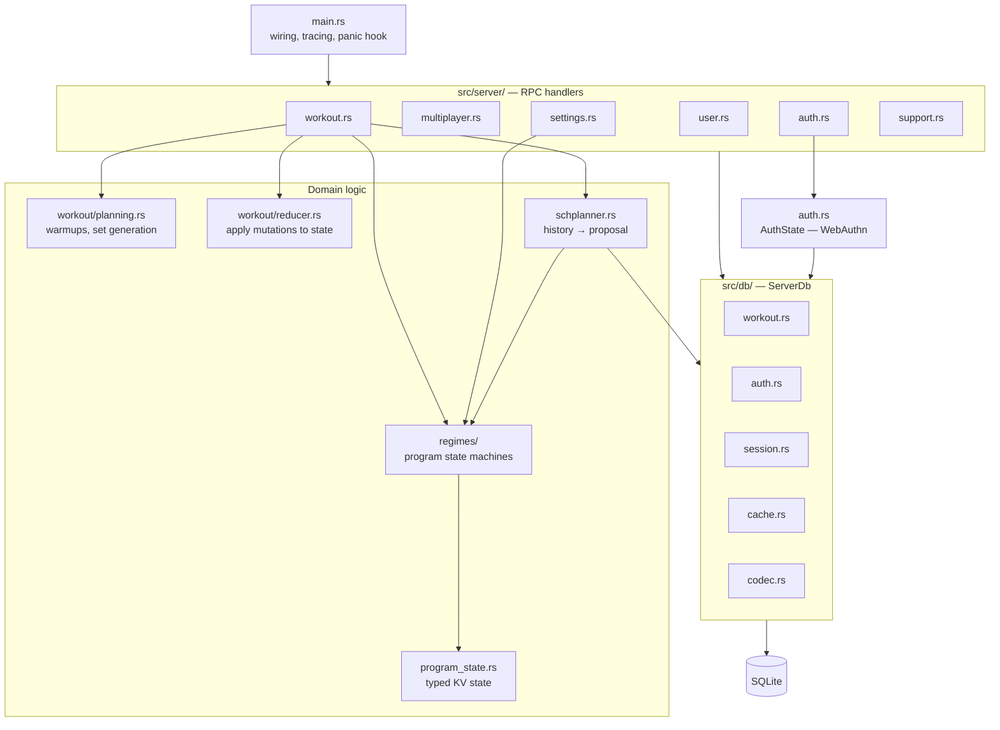
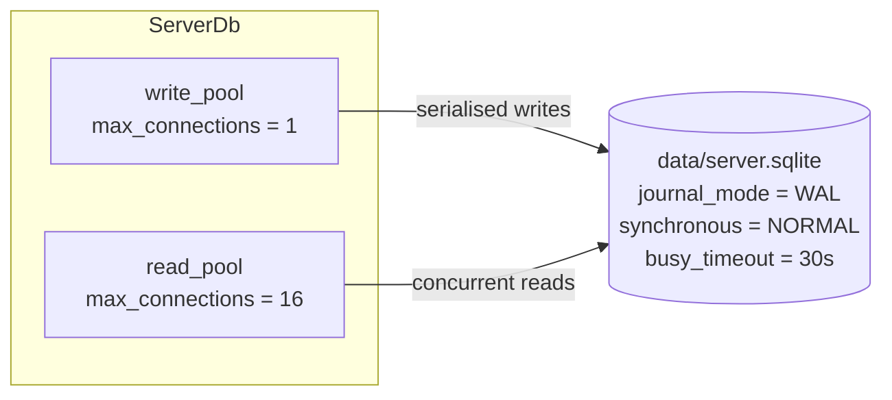
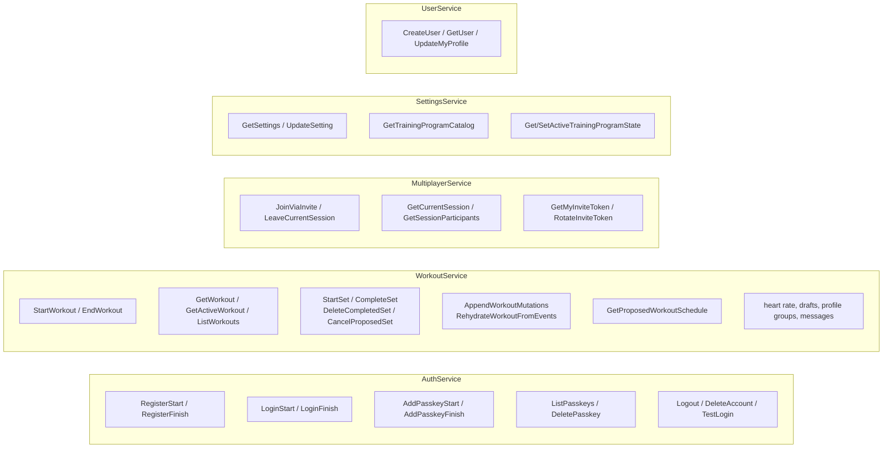

# Backend

A single Rust binary (`src/main.rs`) serving five gRPC services over tonic, with
`tonic-web` for browser clients and a small axum health endpoint.

## Module map



### Responsibilities

| Module | Owns |
|---|---|
| `server/workout.rs` | Workout RPCs, user-message construction, progression on `EndWorkout` |
| `server/multiplayer.rs` | Sessions, invites, participant blobs |
| `server/settings.rs` | User settings, program catalog, active program state |
| `server/user.rs` | User CRUD, profile |
| `server/auth.rs` | Passkey RPC surface (delegates to `auth.rs`) |
| `server/support.rs` | `.well-known` / app-association endpoints |
| `workout/planning.rs` | Turning an `ExerciseGroup` into concrete `ProposedSet`s (warmups, plate snapping) |
| `workout/reducer.rs` | Pure state transitions on an `ActiveWorkout` |
| `schplanner.rs` | Reads workout history, summarises it, asks the regime what's next |
| `regimes/` | Per-program state machines behind the `WorkoutRegime` trait |
| `db/` | All SQL. No SQL exists outside this directory. |

## Database access model

There is **no write-worker thread and no channel**. `ServerDb` holds two sqlx
pools against the same WAL-mode file:



Defined in `src/db/mod.rs:251`.

- **Writes serialise** through the single write connection. This is the
  concurrency control — there is no application-level locking.
- **Reads run concurrently** (16 connections) and, under WAL, never block writes.
- Multi-statement writes use an explicit `write_pool.begin()` transaction; see
  `apply_program_state_for_workout` (`src/db/cache.rs:82`) for the pattern.

### Blob columns

Several tables store a protobuf-encoded blob alongside indexed scalar columns
(`user_blob`, `participant_blob`, `exercise_configs_blob`, `message_blob`,
`response_blob`). The scalars exist purely to index/filter; the blob is the
truth. Encode/decode helpers live in `src/db/codec.rs`.

> **Consequence:** adding a proto field is transparent, but you cannot query on
> it until you also promote it to a real column. Check whether a filter you want
> is actually indexable before designing around it.

### Schema migrations

There is no migration framework. `SERVER_SCHEMA` (`src/db/mod.rs:24`) is a block
of `CREATE TABLE IF NOT EXISTS` run at startup, followed by ad-hoc
`ALTER TABLE ... ` statements whose errors are swallowed with `.ok()`:

```rust
sqlx::query("ALTER TABLE user_message_events ADD COLUMN source_workout_id ...")
    .execute(&write_pool).await.ok();   // ignores "duplicate column"
```

To add a column: add it to `SERVER_SCHEMA` **and** append an idempotent
`ALTER TABLE` for existing databases. Dropping or retyping a column is not
supported by this scheme and needs a hand-written migration.

## Service surface



Every RPC except the auth handshake and catalog lookups begins with
`authed_user_id(&request, &self.db)`, which validates the bearer token against
`auth_sessions`. There is no middleware doing this — it is called explicitly in
each handler, so **a new handler that forgets the call is unauthenticated**.

### Not implemented

Three RPCs exist in the proto and return `Status::unimplemented`:

| RPC | Note |
|---|---|
| `MultiplayerService.SubscribeSession` | Multiplayer uses 1 Hz polling, not streaming (`multiplayer.rs:247`) |
| `SettingsService.GetTrainingProgramStateHistory` | No state history is stored — see [regimes.md](regimes.md#no-history) (`settings.rs:126`) |
| `WorkoutService.RehydrateWorkoutFromEvents` | Events are appended to `workout_events` but never replayed (`workout.rs:1847`) |

The `workout_events` table is therefore **write-only**: `AppendWorkoutMutations`
records events, but nothing reads them back. Recovery works by reloading current
rows via `load_workout_full`, not by replaying events.

Additionally, `GetCurrentSession` returns a `SessionStatus` whose
`next_up_user_id`, `next_up_set`, `next_up_rest_until` and
`currently_lifting_user_id` fields are **always empty**
(`src/server/multiplayer.rs:200`). "Who's up next" is derived on the client from
participant blobs. Do not build on those proto fields expecting server values.

## Error handling

`WorkoutError` (`src/workout/mod.rs:26`) is a small enum of
`FailedPrecondition` / `Internal` / `NotFound` carrying a `&'static str`, with a
`From<WorkoutError> for Status`. Domain code returns `WorkoutError`; handlers
use `?` to convert. `internal_error` maps DB errors to `Status::internal`.

Because the payload is `&'static str`, error messages cannot include dynamic
context (ids, values). That keeps them cheap but makes some failures hard to
diagnose from logs alone.

## Observability

`tracing` with JSON output, flattened events, filtered by `RUST_LOG`
(default `warn`). Each handler emits one `info!` on entry with the RPC name and
user id. A panic hook logs location and message before unwinding.

## Tests

- `src/scenario_tests.rs` — drives an in-memory DB through the real scheduler and
  regime state machines using JSON fixtures in `src/regimes/scenarios/`.
- `src/schplanner.rs` — inline unit tests for history summarisation and replay.
- `src/server/workout.rs` — `live_progression_tests` covering progression messages.

Run with `cargo test`. See [regimes.md](regimes.md#scenario-tests) for how to add
a scenario.
