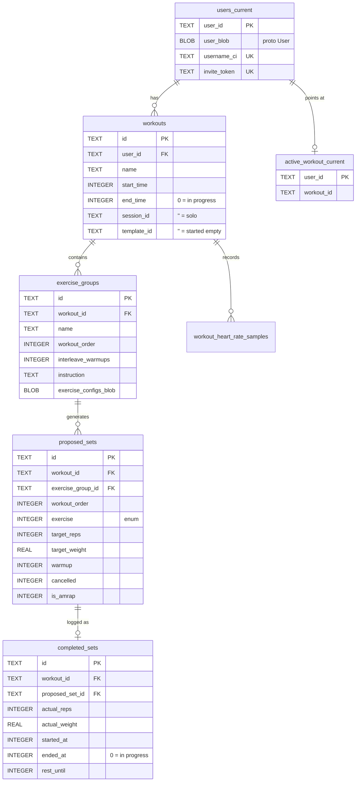
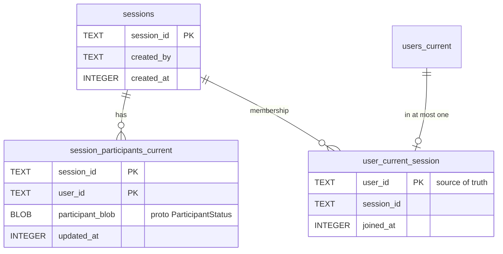
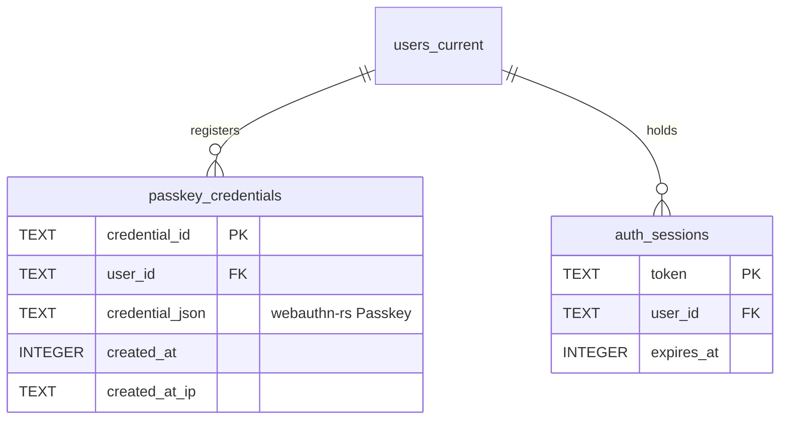
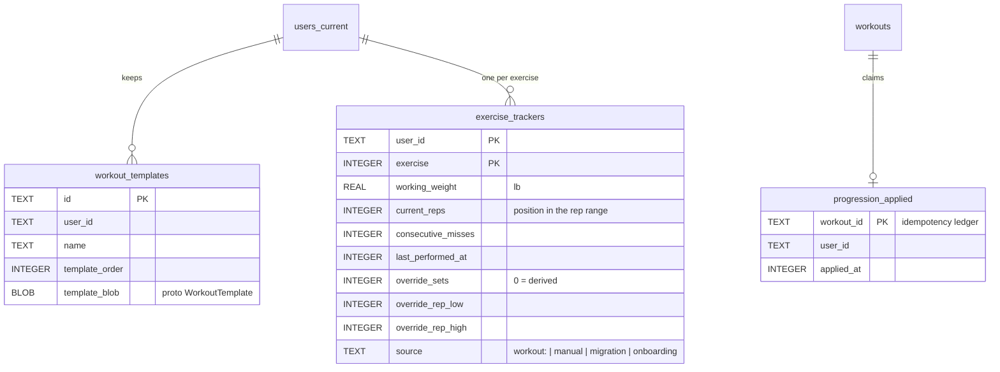

# Data Model

One SQLite file, `data/server.sqlite`, in WAL mode. Schema is defined in
`SERVER_SCHEMA` (`src/db/mod.rs:24`) and created at startup.

## Naming conventions

The suffix tells you the table's shape:

| Suffix | Meaning | Example |
|---|---|---|
| `_current` | One row per key, holding the latest value. Overwritten in place. | `users_current`, `session_participants_current` |
| `_events` | Historically an append-only log. | `user_message_events` |

Note `user_message_events` is a misnomer — it has `PRIMARY KEY(user_id, message_key)`
and is upserted, so it is a `_current` table despite the name.

## Core workout entities

Key points:

- **`end_time = 0` means in progress.** Same for `completed_sets.ended_at`.
  There is no separate status column anywhere; zero-as-null is the convention.
- **`completed_sets` is created on `StartSet`**, not on completion, with
  `ended_at = 0`. A row with `ended_at = 0` is the set currently being performed.
- **`proposed_sets.cancelled`** is a soft delete — skipped warmups and removed
  sets stay in the table so ordering and history remain stable.
- **`active_workout_current`** is the fast path for "does this user have a
  workout open?" It duplicates what a query on `workouts.end_time = 0` would
  give you.

## Sessions (multiplayer)

`user_current_session` has `user_id` as **primary key**, which enforces the
core invariant: a user is in at most one session at a time. Everything else —
`workouts.session_id`, `session_participants_current` — is derived cache.
See [multiplayer.md](multiplayer.md).

## Auth

See [auth.md](auth.md).

## Templates, trackers and progression

- A template holds exercises only; sets/reps/rest/weight resolve from the
  prescription (`src/exercise_catalog.rs`) and the tracker at start time.
- A tracker row is optional: no row means catalog opener weight and the
  derived prescription.
- `progression_applied` is the idempotency ledger. `EndWorkout` claims the
  `workout_id` with `INSERT OR IGNORE` before advancing any tracker, so a
  retried or duplicated `EndWorkout` cannot move a tracker twice.
- `schema_migrations` holds one row per one-time migration
  (`composable_workouts_v1` converted the old program-state world; see
  `src/db/migration.rs`).

## Everything else

| Table | Purpose |
|---|---|
| `user_settings_current` | Per-user settings, keyed by `(user_id, setting_type)` — the weight unit lives here |
| `user_message_events` | Coaching/progression messages, upserted by `message_key`, soft-dismissed via `dismissed_at` |
| `workout_heart_rate_samples` | Heart rate from the watch, one row per sample |

## Referential integrity

There are **no `FOREIGN KEY` constraints** and foreign keys are not enforced.
The `FK` markers in the diagrams above are logical, not declared. Cascading
deletes are done by hand in `delete_user_account_and_data`
(`src/db/auth.rs:270`) — if you add a table keyed by `user_id`, you must add it
to that function or account deletion will orphan rows.
