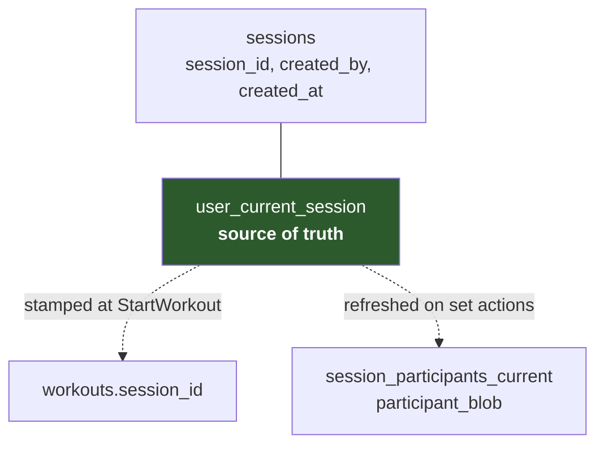
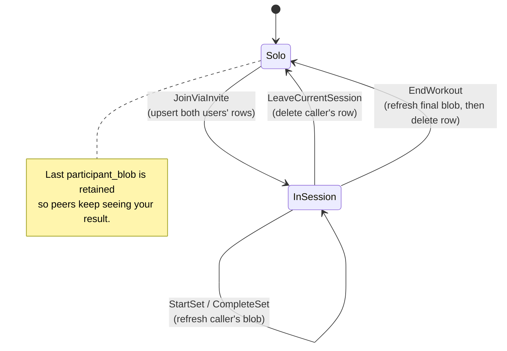
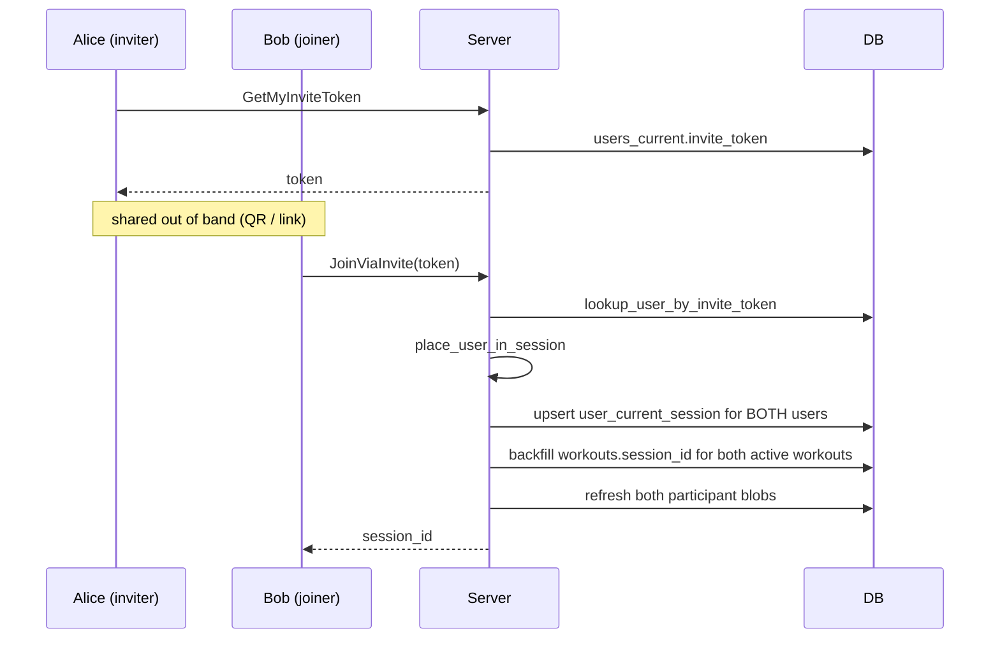
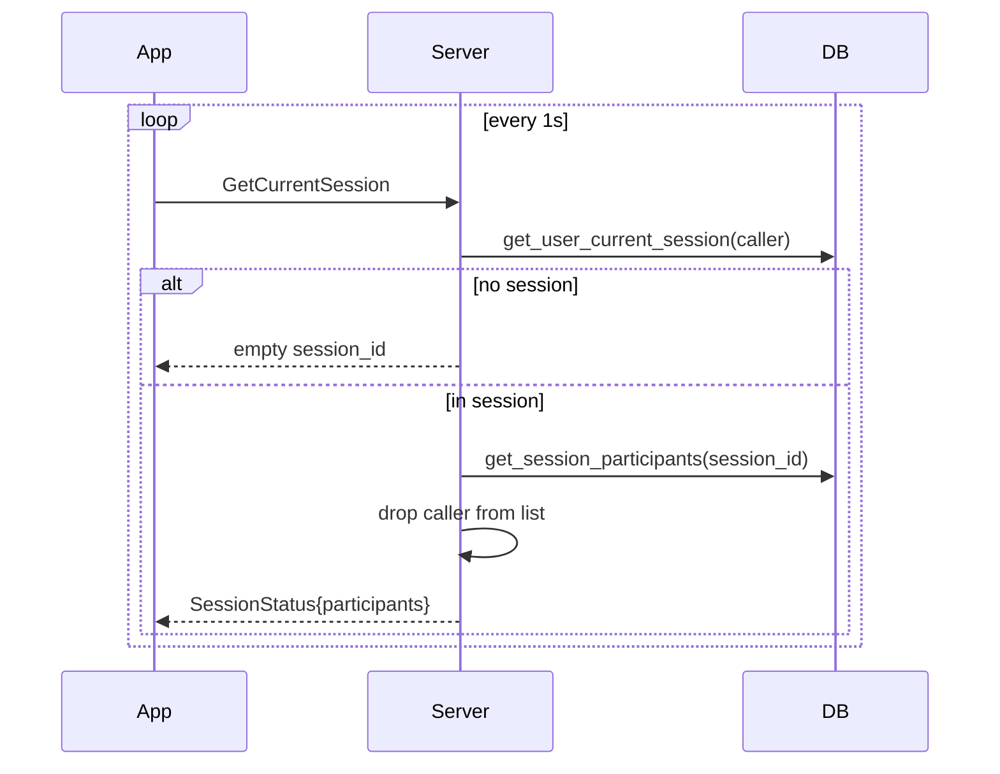

# Multiplayer Sessions

Two or more lifters share a *session* so each can see what the others are doing
and whose turn it is. Sessions are lightweight: they add a `session_id` to
workouts and a fan-out of participant snapshots.

## The invariant

`user_current_session(user_id PRIMARY KEY, session_id, joined_at)` is the single
source of truth for "is this user in a group right now?". Because `user_id` is
the primary key, a user is structurally incapable of being in two sessions.

Everything else is derived cache:

If those disagree, `user_current_session` wins.

## Transitions

Handled across two files:

| Transition | Where |
|---|---|
| `JoinViaInvite`, `LeaveCurrentSession` | `src/server/multiplayer.rs` |
| `StartWorkout` session stamping, set actions, `EndWorkout` | `src/server/workout.rs` |

## Joining

The invite token lives on the user, not the session — it is a stable personal
handle, rotatable via `RotateInviteToken`. Joining someone pulls *both* of you
into a session, creating one if the inviter wasn't already in one.

Backfilling `workouts.session_id` matters: if you were already mid-workout when
you joined, your in-progress workout is retroactively attached to the session.

## Reading session state

The app polls `GetCurrentSession` at **1 Hz** (`MultiplayerProvider`).

Note the server **excludes the caller** from the participants list — the app
renders itself from its own local state and peers from this list.

### The empty next-up fields

`SessionStatus` has `next_up_user_id`, `next_up_set`, `next_up_rest_until` and
`currently_lifting_user_id`. The server sets all of them to empty/zero
(`src/server/multiplayer.rs:200`). "Who's up next" is computed client-side from
the participant blobs. Treat these proto fields as dead.

### Polling resilience

`MultiplayerProvider._poll()` requires **3 consecutive empty responses** before
clearing `_sessionId`, so one dropped request doesn't make the session bar
vanish. Polling calls use a short 5s timeout
(`MultiplayerServiceWrapper._pollCallOptions`) so a stalled request can't block
the next tick.

After any set operation `WorkoutProvider` fires `onSessionRefreshNeeded`, wired in
`app/lib/main.dart:136` to `multiplayerProvider.checkForSession()`, so the
session view updates immediately rather than waiting up to a second for the next
poll tick.

## Why polling

`SubscribeSession` exists in the proto as a server-streaming RPC and returns
`Status::unimplemented`. At the current scale 1 Hz polling over a shared HTTP/2
connection is cheaper to operate than maintaining stream lifecycles across
mobile network transitions and app suspension. Revisit if participant counts or
user counts grow substantially.

## Failure modes to know

- **Stale participant blobs.** A blob is only refreshed when its owner acts. A
  peer who backgrounds the app mid-set leaves a snapshot that ages silently;
  there is no heartbeat or staleness marker.
- **Sessions are never garbage collected.** Rows in `sessions` and
  `session_participants_current` persist after everyone leaves. Harmless at
  current scale, unbounded growth over time.
- **Leaving is not broadcast.** Peers discover it on their next poll, by absence.
