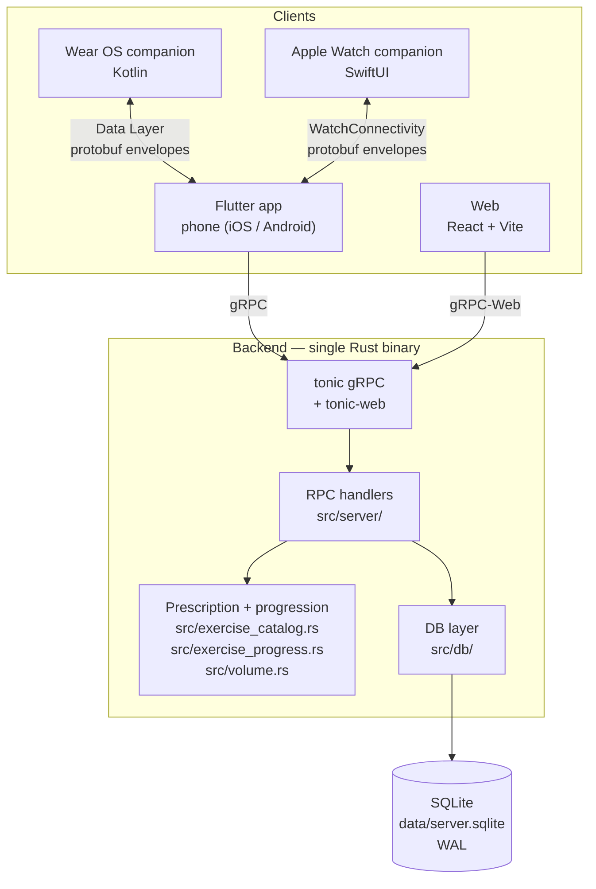
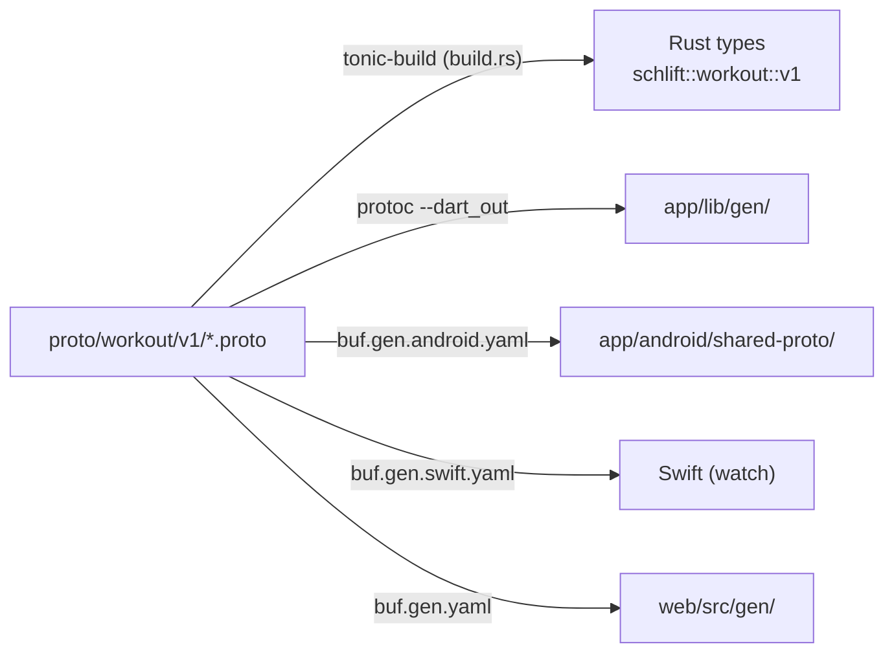
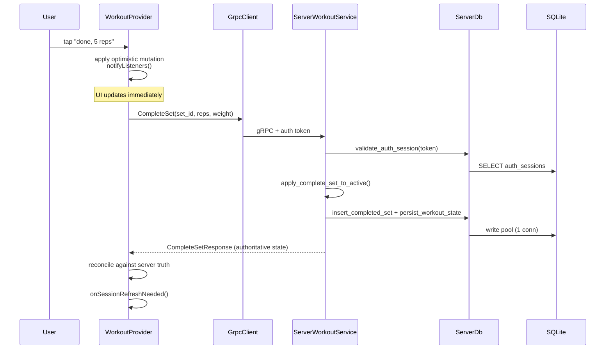
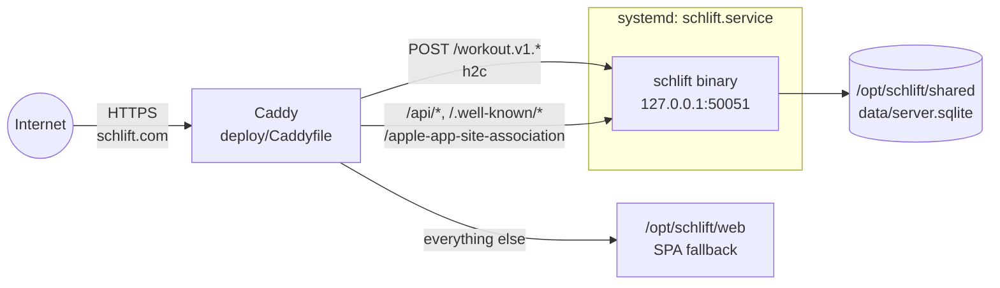

# System Overview

Schlift is a strength-training app. A user composes workout templates, logs
sets against server-prescribed targets, and can share a live session with
other lifters. The phone is the source of truth for the in-progress workout;
the watch is a remote control and sensor.

## Components



The watches never talk to the backend. They exchange protobuf envelopes with
the phone over the platform transport, and the phone relays to the server. This
means a watch works whenever the phone is reachable, regardless of network.

## Repository layout

```
src/                Rust backend
  server/           gRPC handlers, one module per service
  db/               SQLite access (+ the one-time cutover migration)
  workout/          Workout planning + state reduction
  exercise_catalog.rs  Muscles, equipment, the prescription table
  exercise_progress.rs Trackers + double progression
  volume.rs         Weekly sets per muscle + the template suggestion
app/                Flutter app
  lib/screens/      Full-page UI
  lib/widgets/      Reusable UI
  lib/providers/    App state (ChangeNotifier)
  lib/services/     Transport + platform integration
  lib/logic/        Pure functions (no Flutter imports)
  lib/gen/          Generated Dart protobuf — do not edit
  android/wear/     Wear OS companion (Kotlin)
  ios/SchliftWatch/ Apple Watch companion (SwiftUI)
web/                React landing / privacy / account deletion
proto/workout/v1/   Protobuf contracts — source of truth
examples/           load_simulation.rs — gRPC load test
```

## Protobuf is the contract

`proto/workout/v1/` generates code for every client. Nothing else is shared
between the backend and the app.



Regenerate after editing a `.proto`:

```bash
make proto-all      # dart + android + swift
```

Rust regenerates automatically via `build.rs` on the next `cargo build`.

> **Caveat:** generated code is committed. If you edit a proto and forget to
> regenerate, the backend and app will disagree silently until runtime.

## A request end to end

Completing a set, from tap to persisted:



The client applies the change locally first and reconciles when the server
replies. See [workout-lifecycle.md](workout-lifecycle.md#optimistic-mutations).

## Deployment

Production is bare metal: a systemd-managed binary behind Caddy.



Server layout (see `deploy/README.md`):

```
/opt/schlift/
  current -> releases/<git-sha>    # ExecStart target
  releases/
  shared/                          # WorkingDirectory
    data/server.sqlite
    schlift.env                    # EnvironmentFile
```

Deployment is push-to-`main` via `.github/workflows/backend-deploy.yml`: an
ARM64 GitHub runner builds the binary, a self-hosted runner on the server
installs it into a new release directory and restarts the unit.

`docker-compose.yml` + `nginx.conf` are a **separate local/container path**, not
what production runs. Don't assume changes to one apply to the other.

The backend is a single binary with an embedded SQLite file — no external
database, no cache, no queue. See `deploy/` and `docs/releasing.md`.

App releases are tag-triggered: push a `v*` tag to build signed Android/Wear and
iOS artifacts. The version comes from the tag; `app/pubspec.yaml` stays a
`0.0.0+1` placeholder.

## Scale assumptions

The architecture assumes a small user base:

- One SQLite file, one write connection. All writes serialise.
- Multiplayer uses **polling at 1 Hz**, not streaming.
- No horizontal scaling — in-flight WebAuthn challenges live in process memory.

These are deliberate simplifications, validated by `examples/load_simulation.rs`.
