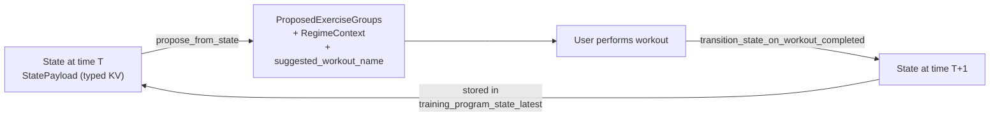
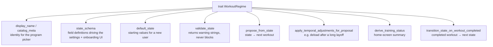
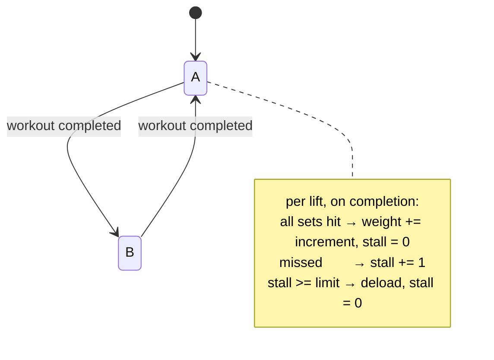
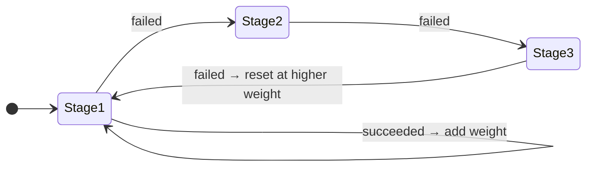
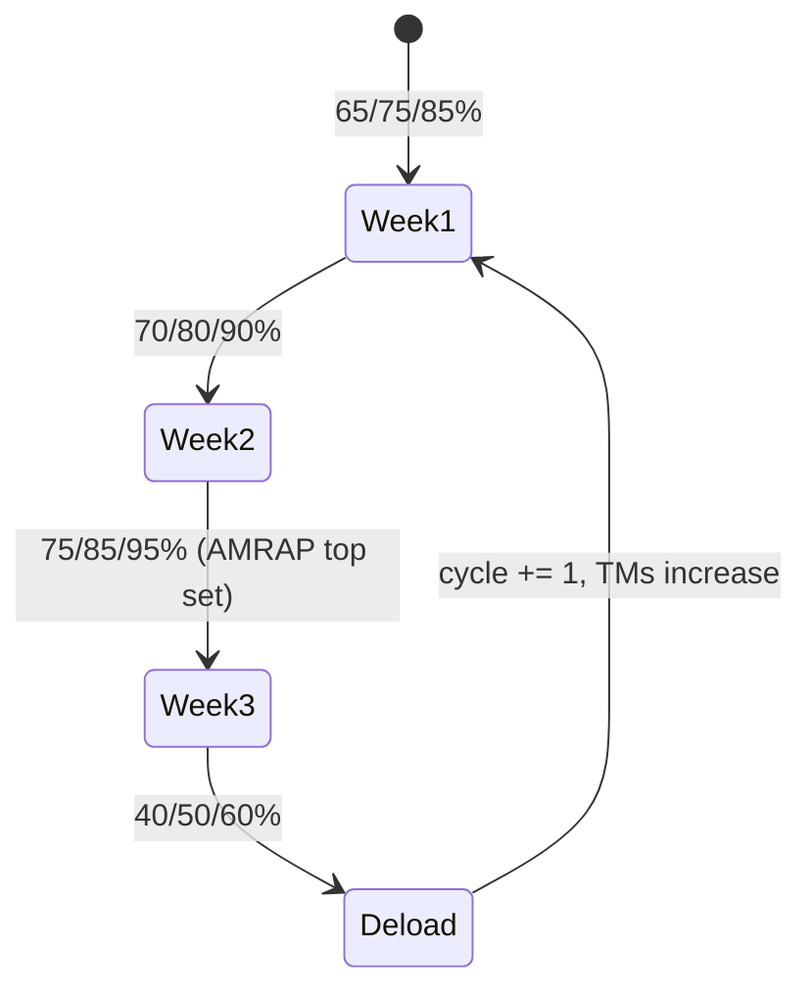
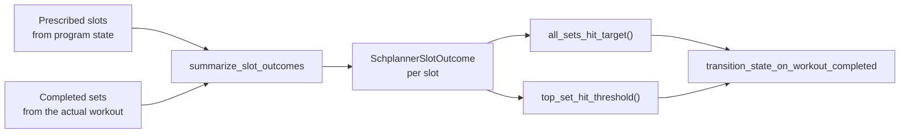
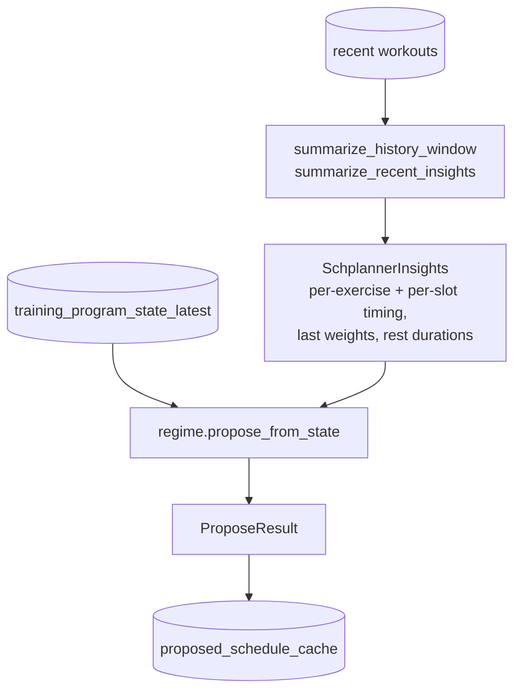
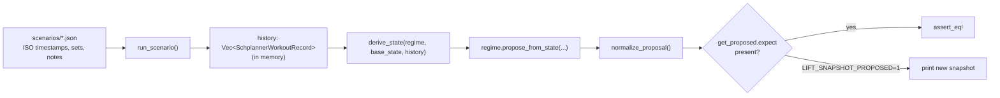

# Training Program Regimes

A *regime* is a training program expressed as a state machine: given the current
program state, it proposes the next workout; given a completed workout, it
produces the next state.

Three are implemented: **Linear 5×5**, **GZCLP**, and **Wendler 5/3/1**.

> This document replaces `docs/design-history/historised_state_machine.md`, which was a design
> plan written before the feature was built and does not describe what shipped.
> See [No history](#no-history).

## The state machine



State is a `StatePayload = HashMap<String, FieldVal>` where `FieldVal` is
`Int | Float | Bool | Str` (`src/program_state.rs`). It is stored as a
protobuf-encoded `GetActiveTrainingProgramStateResponse` blob, one row per user.

Keys are per-regime and untyped at the boundary — a typo in a key name reads as
"missing" and silently falls back to a default via `get_f32_or` and friends.

## The `WorkoutRegime` trait

Defined in `src/regimes/mod.rs:103`. Every regime implements:



`get_regime(regime_type) -> Box<dyn WorkoutRegime>` is the factory
(`src/regimes/mod.rs:183`). Regimes are stateless — all state is passed in.

The **schema drives the UI**. `state_schema()` returns typed field descriptors
(label, help text, section, ordering, min/max/step, enum options) and the Flutter
settings and onboarding screens render themselves from it. Fields marked
`onboarding_field = true` appear during onboarding. Adding a config field to a
regime therefore requires no Flutter changes.

## The three regimes

### Linear 5×5

Alternating A/B workouts, add weight every session, deload after repeated stalls.

State keys:

| Key | Type | Meaning |
|---|---|---|
| `next_workout_variant` | Str | `"A"` or `"B"` |
| `<lift>_weight` | Float | Current working weight per lift |
| `<lift>_stall_count` | Int | Consecutive failures, drives deload |

Lifts: `squat`, `bench_press`, `deadlift`, `overhead_press`, `barbell_row`.



### GZCLP

Three tiers per session. T1 is the heavy main lift moving through rep stages, T2
is volume work, T3 is accessory work driven by AMRAP performance.

State keys: `<lift>_t1_stage`, `<lift>_t1_weight`, `<lift>_t2_stage`,
`<lift>_t2_weight`, `<accessory>_t3_weight`, `next_session_index`,
plus `exercise_<name>` selectors for configurable accessory slots.



T1 Stage 1 and all T3 sets are AMRAP. A T3 AMRAP of 25+ reps adds weight.

The 3-day session order is `[Bench+OHP, Row+Bench, OHP+Row]`; a `four_day`
variant also exists.

### Wendler 5/3/1

Four-week cycles against a Training Max (TM), which is 90% of your 1RM.

State keys: `<lift>_tm` (Float), `cycle` (Int), `week` (Int),
`session_in_week` (Int), `schedule_variant` (`"three_day"` / `"four_day"`).



**TM is stored raw** — `1RM × 0.9` with no rounding. Rounding happens only when
computing working sets: `round(TM × pct / 5) × 5`. Storing the rounded value
would compound rounding error across cycles.

## Progression reconciliation

When a workout completes, the regime must decide what you actually did — which
is not necessarily what it prescribed, since the user can edit anything.

Matching is **by exercise via progression slot keys**, not by group index or
position. `progression_slot_key(exercise)` gives an exercise its progression
identity, and `summarize_slot_outcomes` (`src/schplanner.rs:616`) compares
prescribed slots against completed work.



Consequences:

- Swapping the order of your exercises does not confuse progression.
- Per-set progression *hints* attached to `ProposedSet` are **display-only**.
  They are not what drives progression — the slot outcome comparison is.
- An edited workout still progresses correctly, as long as the exercise matches.

> **Never match exercise groups by exercise type when editing** — use group
> index. The reverse of the progression rule. Two groups can hold the same
> exercise, and resolving a warmup's working weight across groups picks the
> wrong one. See `src/workout/planning.rs`.

## Time off: the layoff deload

`apply_temporal_adjustments_for_proposal` lets a regime react to *when* you're
training, not just what you did. All three implement the same policy:

| Gap since last session | Next proposal |
|---|---|
| under 14 days | unchanged |
| 14–29 days | 90% |
| 30 days or more | 80% |

There is no further step past 30 days, and a user with no previous session is
never deloaded. `maybe_annotate_temporal_adjustment`
(`src/server/workout.rs:480`) surfaces the explanation to the user as a message.

```mermaid
sequenceDiagram
    participant App
    participant Sched as GetProposedWorkoutSchedule
    participant End as EndWorkout
    participant State as training_program_state_latest

    App->>Sched: what should I do?
    Sched->>State: read stored weights
    Sched->>Sched: apply_temporal_adjustments_for_proposal<br/>(45 days off -> 80%)
    Sched-->>App: deloaded proposal
    Note over App,State: stored state is NOT changed —<br/>viewing a proposal never mutates it

    App->>End: I did that session
    End->>State: read stored weights
    End->>End: apply the SAME adjustment
    End->>End: reconcile the session against it
    End->>State: write the result
    Note over State: the deload persists only once<br/>you actually train
```

Two properties this design gives you, both covered by tests:

- **Viewing is free.** Opening the app after a holiday shows lighter weights but
  writes nothing. Your program is untouched until you complete a session.
- **The deload sticks once you train.** Complete the reduced session and you
  progress from *that* weight, rather than snapping back to your pre-break load.

> **Both handlers must apply the adjustment.** The proposal is built in
> `get_proposed_workout_schedule` and reconciled in `end_workout`; if only the
> first applies the deload, a user is graded against work they were never asked
> to do. Because the regimes' failure branches hold the *state* weight rather
> than the attempted one, that asymmetry made a failed comeback session
> prescribe the pre-layoff weight — heavier than what was just missed. Covered
> by `layoff_deload_tests` in `src/server/workout.rs`.

A failed session can never raise the next prescription: Linear 5×5 holds
`min(attempted, stored)`.

## Scheduler integration

`src/schplanner.rs` sits between the DB and the regimes:



`SchplannerInsights` carries recent timing statistics (average set duration,
average rest) so proposals can be realistic about session length.

`get_proposed_schedule(user_id, now)` takes an explicit `now` — pass `0` to use
system time. Tests pass a fixed timestamp.

## No history

`docs/design-history/historised_state_machine.md` describes an append-only event log of program
state, with replay and a history UI. **That was not built.** What exists:

| Planned | Actual |
|---|---|
| `training_program_state_events` append-only table | Does not exist |
| `append_program_state_event` | Does not exist |
| `get_program_state_history` | Does not exist |
| Replay events → latest snapshot | No replay; `_latest` is written directly |
| `GetTrainingProgramStateHistory` RPC | Returns `Status::unimplemented` |
| `ApplyPendingStateUpdate` RPC | Does not exist in the proto at all |

The shipped design keeps **one snapshot per user** in
`training_program_state_latest`, overwritten on each change. Program state
changes are not auditable, and a bad progression cannot be rolled back by
replaying to an earlier point.

Idempotency is handled instead by the `program_progression_applied` ledger — see
[data-model.md](data-model.md#program-state-and-progression).

## Scenario tests

Regime behaviour is covered by JSON scenarios in `src/regimes/scenarios/`, run by
`src/scenario_tests.rs`.

These are **pure state-machine tests — there is no database and no server**.
`run_scenario` keeps history in a plain `Vec<SchplannerWorkoutRecord>` and calls
`derive_state` and `regime.propose_from_state` directly:



So they cover progression logic thoroughly and cover persistence, RPC handling,
and the scheduler's DB reads not at all. Handler-level coverage lives separately
in `live_progression_tests` (`src/server/workout.rs`), which builds a real
`ServerDb::new_in_dir` against a temp directory.

To add a scenario:

1. Write the JSON with ISO timestamps and all working sets listed.
2. Set `regime_config.initial_state` for direct state overrides, or
   `one_rep_maxes` for Wendler (raw TM = 1RM × 0.9, unrounded).
3. Set `schedule_variant` explicitly for non-default variants, e.g.
   `"three_day"`.
4. Register a `#[test]` calling `run_scenario("src/regimes/scenarios/<name>.json")`.
5. Regenerate expectations with `LIFT_SNAPSHOT_PROPOSED=1 cargo test`, or via
   `src/regimes/scenarios/refresh_proposed_expectations.py` — then **read the
   diff**, since regenerating will happily bless a regression.

`src/regimes/scenarios/scenario_timeline_visualizer.html` renders a scenario as a
timeline for eyeballing.

## Adding a regime

1. Implement `WorkoutRegime` in `src/regimes/<name>.rs`.
2. Add the variant to `RegimeType` in the proto and regenerate.
3. Register it in `get_regime` and `catalog_regime_types`
   (`src/regimes/mod.rs`).
4. Define `state_schema()` — this alone gives you settings and onboarding UI.
5. Add a scenario JSON and expectations.

No Flutter changes are required for a new regime unless it needs bespoke UI.
