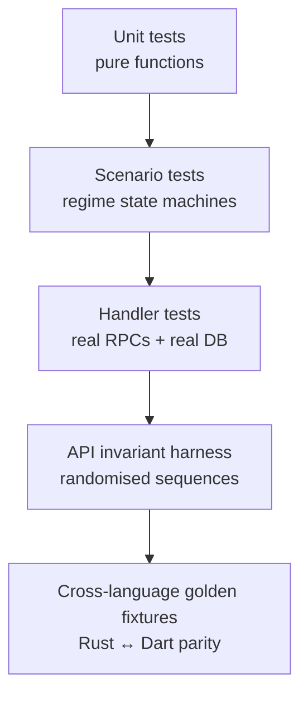
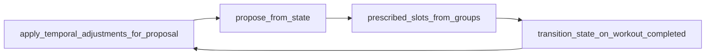

# Testing

Five layers, each catching something the others cannot.



```bash
cargo test                 # backend: units, scenarios, handler tests
cd app && flutter test     # Flutter: logic + parity
make fuzz-api              # randomised API sequences, random seed
make fuzz-api-ci           # the fixed-seed run CI uses
```

## Scenario tests — regime progression

`src/regimes/scenarios/*.json` driven by `src/scenario_tests.rs`.

These are **pure**: no database, no server. History is a plain
`Vec<SchplannerWorkoutRecord>` fed through `derive_state` and
`propose_from_state`. That makes them fast and precise about progression logic,
and blind to persistence, RPC handling and anything that spans two handlers.

Regenerate expectations with `LIFT_SNAPSHOT_PROPOSED=1 cargo test`, then **read
the diff** — regenerating will happily bless a regression.

## Timeline fixtures — whole-program behaviour

`testdata/regime_timelines.json`, generated by `src/regimes/simulator.rs`, runs
each regime forward through five situations (steady progress, occasional misses,
stalling out, a six-week layoff, two layoffs) from several starting points.

It uses the same call sequence production does, including the layoff deload:



Sessions record only the weights that *changed*, so a diff shows exactly what a
session did. This doubles as the data behind
[`docs/regime-explorer.html`](../regime-explorer.html).

```bash
LIFT_SNAPSHOT_TIMELINE=1 cargo test regime_timeline
node scripts/build_regime_explorer.mjs
```

## Handler tests — the seams between RPCs

`live_progression_tests` and `layoff_deload_tests` in `src/server/workout.rs`
build a real `ServerDb::new_in_dir` on a temp directory and drive real RPCs.

These exist because some behaviour only appears **between** two handlers. The
layoff deload is applied in `get_proposed_workout_schedule` but the session is
reconciled in `end_workout`; a bug where those two disagreed was invisible to
the scenario tests and is the reason this layer exists.

## API invariant harness

`examples/api_invariant_fuzz.rs` spawns its own backend on its own port with its
own SQLite file, then drives randomised but realistic sequences — start a
workout, complete sets, skip sets, delete completed sets, edit a group's plan
mid-workout, reorder groups, end the workout (sometimes twice) — with several
users running concurrently.

After **every mutation** it re-reads the workout and asserts:

| Invariant | Catches |
|---|---|
| Completed sets reference an existing proposed set | Orphaned rows after edits |
| A proposed set is completed at most once | Double-completion races |
| `workout_order` is unique among live sets | The "sets jump around" class of bug |
| Live sets belong to a group that exists | Group deletion leaving orphans |
| `next_up_set` is live, uncancelled and not already done | Bad next-up derivation |
| At most one set in progress | Overlapping `StartSet` |
| Weights finite and non-negative, reps non-negative | Arithmetic and rounding faults |
| No active workout remains after `EndWorkout` | Leaked `active_workout_current` |

```bash
make fuzz-api                                   # random seed
make fuzz-api FUZZ_USERS=20 FUZZ_SESSIONS=25    # heavier
cargo run --release --example api_invariant_fuzz -- --seed 42   # replay a failure
```

A failure groups violations by invariant and prints the seed to reproduce it.
Exit status is non-zero, so it gates CI (`make fuzz-api-ci`).

> The harness needs the `TestLogin` RPC, so it builds the backend with
> `--features test-auth`. Production builds do not enable that feature — see
> [auth.md](auth.md#test-login).

**Validate the validator.** "No violations" only means something if the harness
can fail. When adding an invariant, break the code deliberately and confirm it
trips. Removing the `DELETE FROM active_workout_current` from
`ServerDb::end_workout`, for instance, should produce
`workout is still active after EndWorkout`.

## Mirrored reducers

`app/lib/logic/workout_reducer.dart` and `src/workout/reducer.rs` implement the
same optimistic set transitions on each side of the wire. Both carry a test
suite asserting the same behaviours (idempotent start, one-tap completion,
success/failure/end-of-group rest, warmup-only skipping), so a semantic change
on either side that is not mirrored fails one of the suites. This has already
caught a real divergence: the client used a 10-second end-of-group rest against
the server's 60.

## Cross-language golden fixtures

`src/workout/planning.rs` and `app/lib/logic/warmup.dart` are independent ports
of the same warmup and plate-snapping maths. The app computes warmups locally for
instant feedback; the server computes the authoritative ones. Drift shows up as
the user's warmups changing when the server replies.

`testdata/warmup_golden.json` is generated from Rust and asserted against by
**both** suites, so a change to either side that is not mirrored fails the build.

```bash
LIFT_SNAPSHOT_WARMUP=1 cargo test warmup_golden   # regenerate
cd app && flutter test                            # confirm Dart still agrees
```

The sweep covers every 2.5 lb from 5 to 600 plus off-grid values. Density
matters: the divergence this caught on its first run existed at exactly one
weight (175 lb, where `175 * 0.70` is `122.5` in f32 but `122.49999999999999` in
f64 — opposite sides of a rounding boundary).

## Where coverage is thin

Honest gaps, roughly in priority order:

- **Multiplayer** has no automated coverage at all. The fuzz harness is
  single-user per workout and never joins sessions — extending it with
  JoinViaInvite + concurrent session members is the next highest-value step.
- **Wearable protocol** is untested end to end; the watch companions have no
  automated tests.
- **`src/db/`** is covered only incidentally, apart from account deletion.
