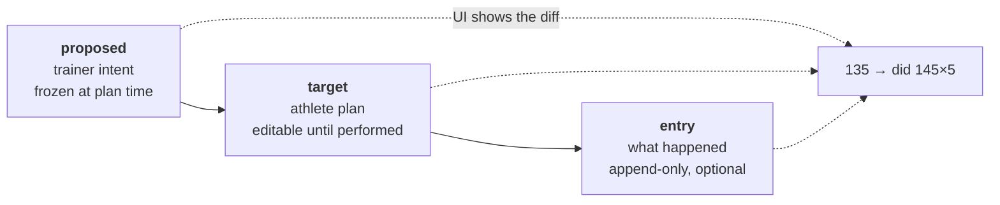
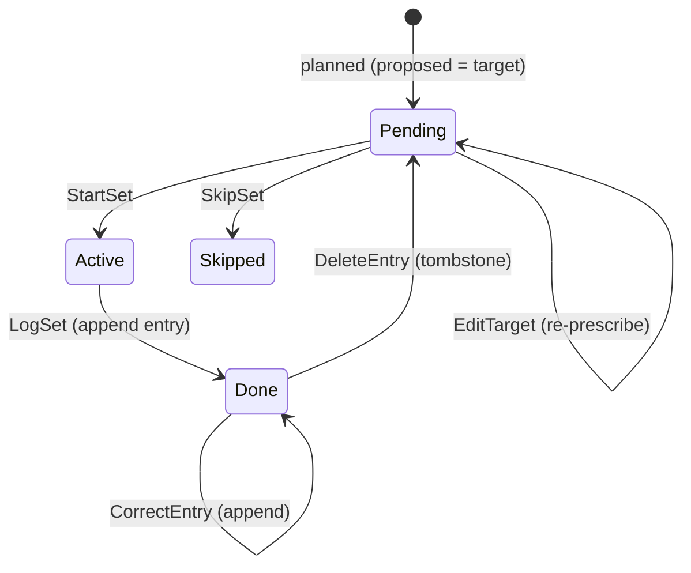
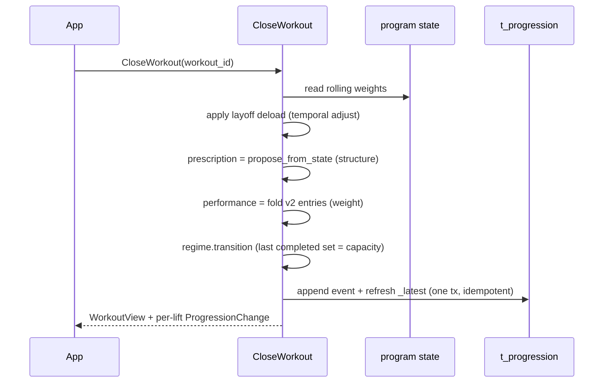

# Training Model (v2)

The workout and progression model designed from first principles, built as an
additive `TrainingService` (`proto/workout/v1/training.proto`,
`src/server/training.rs`, `src/db/training.rs`) alongside the existing v1 path.
It is validated end to end through its own RPCs; the v1 workout path is
untouched, so the shipped app keeps working while this is proven.

> Status: backend built and tested (17 API-level scenario tests, benchmark).
> Flutter integration and the v1→v2 data migration are not done — see
> [Cutover](#cutover).

## The one idea

A workout tracks two things that can diverge, and the divergence is meaningful:
**what the trainer prescribed** and **what the athlete did**. Keeping them
explicit and separate is the whole design.

Every `Set` carries three facets (`SetView` in the proto): `proposed`, `target`,
and an optional `entry`. The UI shows intent vs change vs result from one record.

## The seven parts

| Part | Where | Editable | Notes |
|---|---|---|---|
| Prescription (`proposed`) | `t_sets.proposed_*` | no | frozen at plan time |
| Plan (`target`) | `t_sets.target_*` | until performed | starts == proposed |
| Performance (`entry`) | `t_entries` (append-only) | via new appends | the record of what happened |
| Execution pointer | `t_workouts.active_set_id` | — | the live set + rest clock |
| Program state | `training_program_state_latest` | `CloseWorkout` / manual | rolling weights, counters |
| Progression ledger | `t_progression` (append-only) | append-only | one row per closed workout |
| Session projection | (v1 multiplayer, unchanged) | — | read-only peer view |

## Editing: one endpoint, typed ops

The entire write surface of a workout is **`MutateWorkout(workout_id, [ops])`** —
a list of typed operations applied in order. One batchable, offline-friendly
round-trip. Every UI action maps to one op:

| UI action | Op | Touches |
|---|---|---|
| Change a weight (not yet done) | `EditTarget` | `target` on one set (UPDATE) |
| Add a set | `AddSet` | one INSERT |
| Remove a set | `RemoveSet` | one UPDATE (`removed=1`) |
| Skip a warmup | `SkipSet` | one UPDATE (`skipped`) |
| Tap "start" | `StartSet` | active pointer (UPDATE) |
| Log a set | `LogSet` | append one entry |
| Fix a set you did | `CorrectEntry` | append a superseding entry |
| Undo a logged set | `DeleteEntry` | append a tombstone |
| Drag to reorder blocks | `ReorderBlocks` | UPDATE block orders |
| Add a whole block | `AddBlock` | INSERT block + sets |

Nothing regenerates the workout; nothing is a whole-workout rewrite. Order is
stable, so there is no "sets jump around" class of bug.

## Entries are append-only and bitemporal

An entry is never mutated or hard-deleted. A correction is a new entry; a delete
is a tombstone. Two timestamps:

- **`performed_at`** — when the set happened in the real world. Editable;
  back-datable ("I did this yesterday, logging it now").
- **`recorded_at`** — when the row was written. Audit fact; never edited.

The current truth of a set is the **newest non-tombstoned entry**, ordered by
`(recorded_at, rowid)` — rowid breaks same-second ties, since `recorded_at` is
second-granularity and a log plus its correction can share it. (This ordering
was a real bug the scenario tests caught: without the rowid tiebreak, a
same-second tombstone didn't win.)

Nothing is thrown out, so the workout log is a complete history, and — because
`current program state = fold(ledger)` — a past correction *can* be replayed
forward deterministically. That re-fold is an explicit action, never automatic:
history stays honest, the program stays stable.

## CloseWorkout: the one seam

Closing a workout is the single place performance becomes program change:

This **reuses the existing regime machinery unchanged**: the prescription is
derived fresh from program state (so structure comes from the program), the
performance comes from v2 entries (so weight comes from what you did), and
progression follows the agreed rule — *the last set you actually completed is
your current capacity*. Finish heavier → progress up; drop weight to finish →
regulate down; miss a set → stall. Freestyle workouts
(`counts_toward_program = false`) are logged but skipped here entirely.

Idempotent by `(user, workout)` primary key: a re-fired close is a no-op.

## Session over session

`t_progression` is the append-only ledger — one snapshot per closed workout,
with the reason and the driving performance. `GetProgressionHistory` reads it
for the per-lift progress chart and the "why did this change?" rationale. The
current program state is the newest entry; the history is the sequence.

## Freestyle

A set with no regime prescription (`counts_toward_program = false`, empty
`slot_key`) is logged and charted like any other, but `CloseWorkout` ignores it.
So any modality — a run, curls, a plank — rides the same entry log for
progress-tracking without ever touching the adaptive trainer. Entries carry a
general `Measure` (weight, reps, duration, distance) so non-barbell work fits.

## Why this is simpler, more expressive, and faster

- **Simpler:** ~5 endpoints where v1 has ~15; one op-list where v1 has StartSet,
  CompleteSet, DeleteCompletedSet, CancelProposedSet, ReplaceExerciseGroupPlan,
  ReorderExerciseGroups, AppendWorkoutMutations. No seeding actual-from-target,
  no `cancelled` tombstone regeneration, no `last-by-time` heuristic guessing
  what you did — the entry *is* what you did.
- **More expressive:** proposed vs target vs entry are first-class, so the UI
  can show intent, change, and result; append-only entries make correction and
  back-dating lossless; the ledger makes session-over-session history real.
- **Faster:** every edit is a row op (O(1)) instead of a whole-workout rewrite
  (O(N)); a full session is O(N) instead of O(N²), and can flush in one
  round-trip. See [`bench_training.rs`](../../examples/bench_training.rs) —
  `make bench-training`.

## Mapping from the current app

For the Flutter side, the mental shift is small because the model matches how a
workout screen already thinks:

| v1 concept | v2 |
|---|---|
| `ProposedSet.target_weight` (mutated in place) | `Set.target` (edit via `EditTarget`) |
| `CompletedSet` seeded at StartSet | `entry`, created only on `LogSet` |
| `cancelled` flag + regenerate | `RemoveSet` / `SkipSet`, stable order |
| `AppendWorkoutMutations([...])` | `MutateWorkout([ops])` — same batching, row-level |
| `EndWorkout` + reconcile | `CloseWorkout` — same regimes, cleaner inputs |
| progression hints on sets (display-only) | gone; `CloseWorkout` derives prescription itself |

`WorkoutProvider`'s optimistic-mutation loop maps almost directly: apply an op
locally, queue it, flush the queue as one `MutateWorkout`, reconcile with the
returned `WorkoutView`.

## Cutover

Done: the backend model, its RPCs, 17 API-level scenario tests, the benchmark,
account-deletion coverage of the new tables.

Not done, in order:
1. **Flutter integration** — a `TrainingService` client, the three-facet set
   card (proposed struck, target active, entry logged), and pointing the
   optimistic loop at `MutateWorkout`.
2. **Data migration** — v1 `proposed_sets` → `t_sets` (proposed = target),
   `completed_sets` (ended) → `t_entries`, in-progress → active pointer,
   `cancelled` → `removed`/`skipped`; `program_progression_applied` → seed
   `t_progression`.
3. **Retire v1** — once the app is on v2 and data is migrated, remove the v1
   workout RPCs and tables.

The regime state machines, layoff deload, and progression semantics are
unaffected by the cutover — they operate on program state and slot outcomes,
which v2 feeds more cleanly than v1 did.
