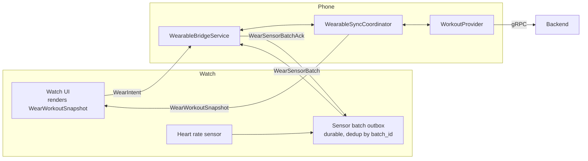
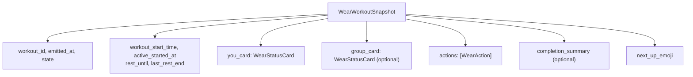
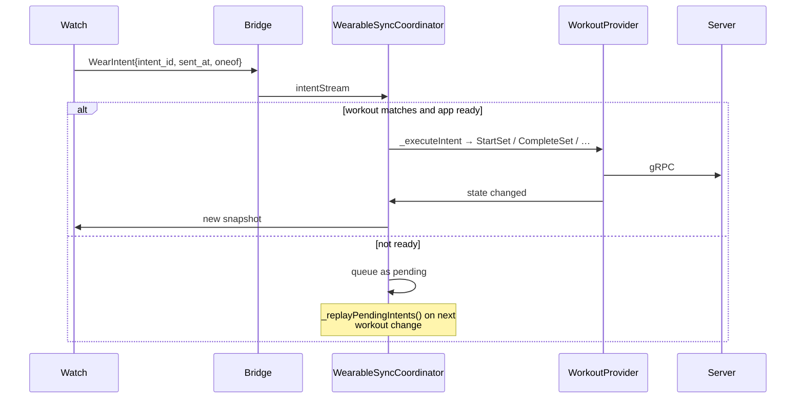
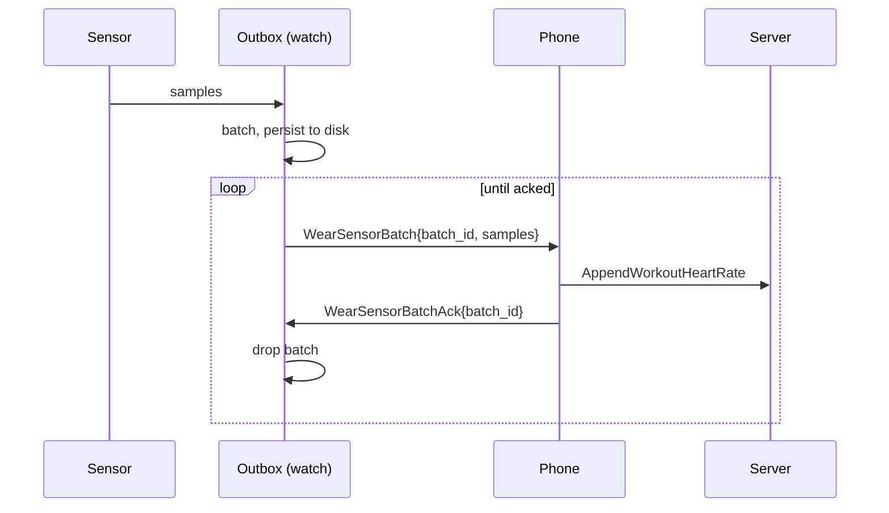

# Wearable Companions

Wear OS and Apple Watch apps act as a remote control and heart-rate sensor. They
**never talk to the backend** — everything goes through the phone.

## Topology



The phone is authoritative. The watch holds no workout state of its own — it
renders whatever snapshot it was last given and sends intents back.

## Transport

One abstract interface, two platform implementations:

| Platform | Transport | Native code |
|---|---|---|
| Wear OS | Data Layer API | `app/android/app/src/main/kotlin/.../wearbridge/`, `app/android/wear/` |
| watchOS | `WatchConnectivity` | `app/ios/Runner/WearBridge/`, `app/ios/SchliftWatch/` |

`WearableBridgeService` (`app/lib/services/wearable_bridge_service.dart`) is the
Dart-side abstraction; `PlatformWearableBridgeService` implements it over one
`MethodChannel` plus two `EventChannel`s (intents, sensor batches).
`NoopWearableBridgeService` is used where no watch exists, so the rest of the app
never branches on platform.

Payloads are protobuf messages from `proto/workout/v1/wearable.proto`, so the
same contract is generated for Dart, Kotlin and Swift.

## Snapshot: phone → watch

`WearWorkoutSnapshot` is a fully-rendered view model, not raw domain state:



A `WearStatusCard` carries `state_label`, `timer_text`, and a `display_set` —
strings the watch prints directly. A `WearAction` carries its own `label`,
`style` and `set_id`, so the watch renders buttons without knowing what a warmup
is or when a set is skippable.

This keeps watch logic minimal and means UI changes usually need no watch
release. The cost is that snapshots are chunky and must be republished on every
state change. `WearableSyncCoordinator._publishSnapshot({force})` rebuilds via
`WearableSnapshotBuilder` whenever the workout changes.

Timers are sent as **absolute Unix timestamps** (`rest_until`,
`active_started_at`), not durations, so the watch counts down against its own
clock without drifting as messages are delayed.

## Intents: watch → phone



Intent types: `StartSetIntent`, `CompleteSetIntent`, `SkipWarmupIntent`,
`EndWorkoutIntent`.

Every intent carries a client-generated `intent_id` for dedupe, because the
platform transports can deliver more than once. `CompleteSetIntent` also carries
`completed_at` — **the time of the first tap** — so a delayed delivery records
when you actually finished the set, not when the message arrived.

Intents arriving while the phone app isn't ready are queued and replayed rather
than dropped.

## Heart rate



The outbox (`WatchSensorBatchOutbox.swift`, `WearSensorBatchOutbox.kt`) is
**durable** — batches survive the watch app being killed and are retried until
acked. This is why heart-rate data survives a watch app crash mid-workout.

Sample timestamps are Unix **milliseconds** (`HeartRateSample.sampled_at`), while
most other timestamps in the system are seconds. `WorkoutHeartRatePoint` rows in
SQLite are stored per sample.

`HeartRateAvailability` distinguishes `AVAILABLE` / `ACQUIRING` / `UNAVAILABLE`,
so the UI can show "finding your heart rate" rather than a misleading zero.

## Clock skew

`getWatchClockSync()` returns a `WatchClockSync` with the watch's clock reading
plus send/receive timestamps, and computes:

```
roundTripMs              = receivedAtMs - sentAtMs
estimatedPhoneMidpointMs = sentAtMs + roundTripMs / 2
deltaMs                  = watchTimeMs - estimatedPhoneMidpointMs
```

A simple midpoint estimate — it assumes a symmetric round trip. Good enough to
correct sample timestamps by a known offset; not a substitute for NTP.

## Ending a workout

Ending from the phone is the awkward case: the phone **cannot** stop the watch's
`HKWorkoutSession` directly. `endWatchWorkout(workoutId)` sends a dedicated
guaranteed-delivery command that the watch acts on. On platforms where the OS
already stops tracking reliably this is a no-op.

This is why the watch keeps a lock so that a late-arriving snapshot cannot
restart an ended session — a stale snapshot must not resurrect a workout the
user finished on their phone.

## Building and running

```bash
make watch-setup        # one-time: generate Xcode project bits
make watch-build        # build the watchOS app
make watch-sim          # run in the watch simulator
make run-wear           # Wear OS on a connected device/emulator
make run-wear-logs      # tail Wear OS logs
```

Wear OS emulator pairing is fiddly under WSL2 — see
[`docs/android_dev.md`](../android_dev.md).

Regenerate wearable protos for the native sides after editing the proto:

```bash
make proto-android      # Java for Wear OS
make proto-swift        # Swift for watchOS
```
