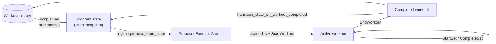
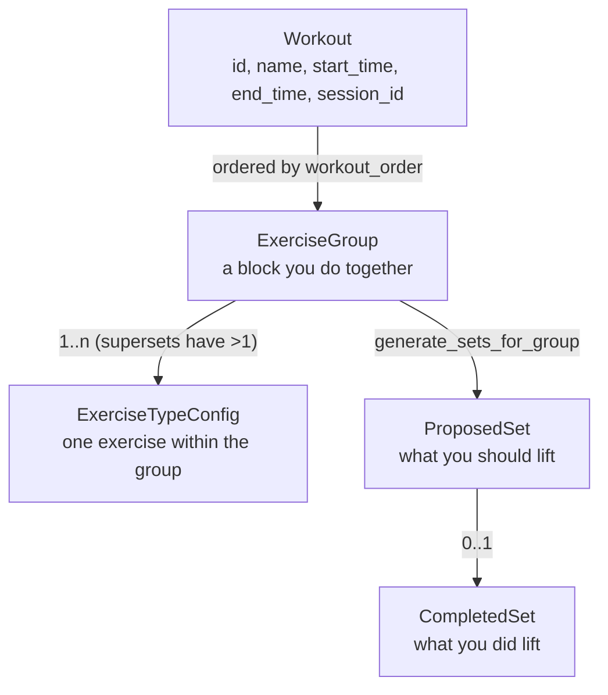
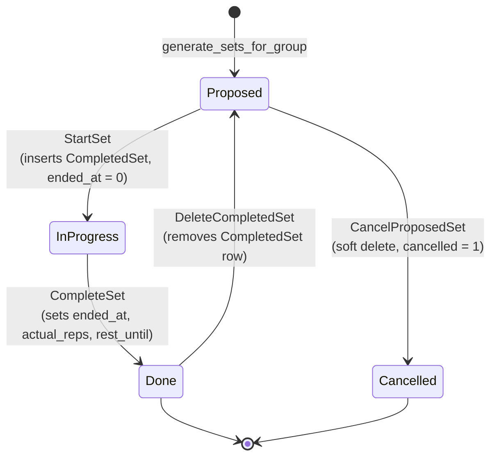
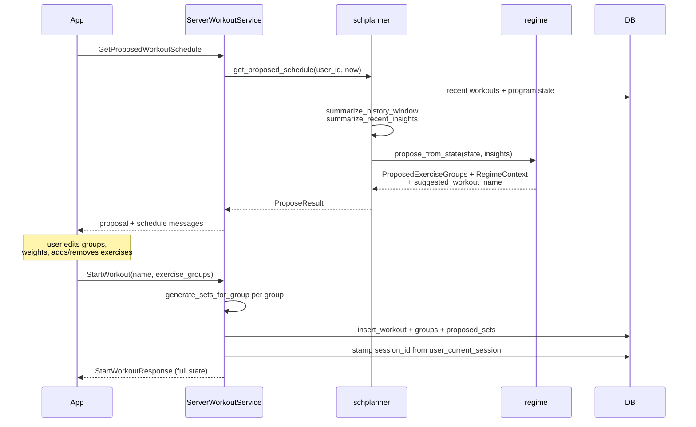
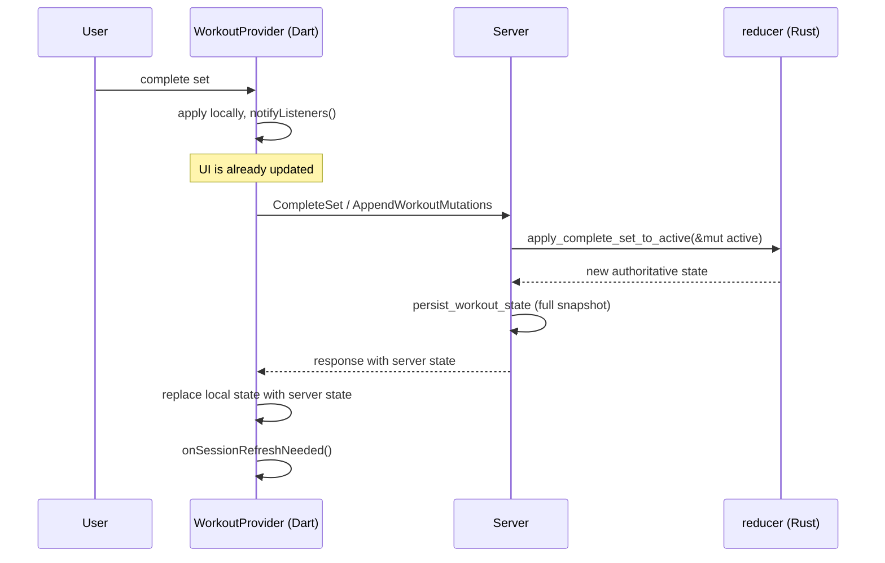
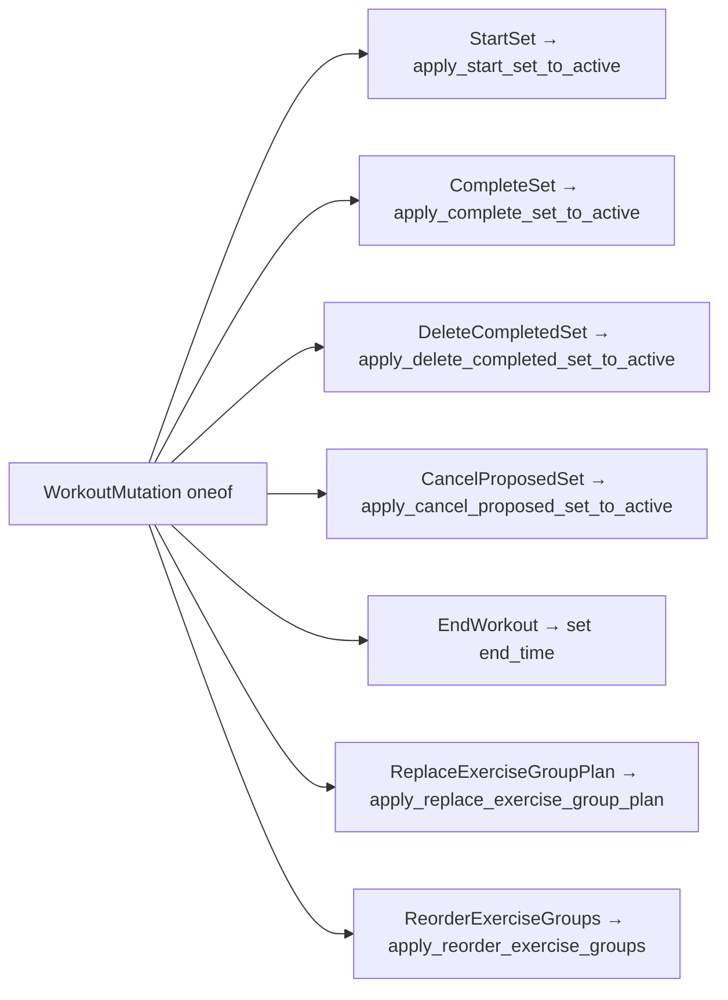
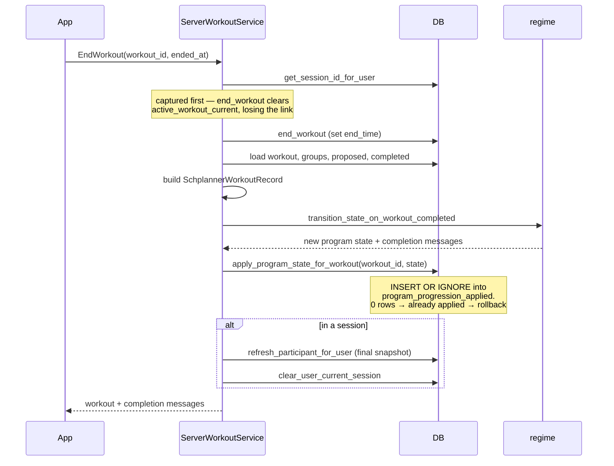

# Workout Lifecycle

This is where most of the system's complexity lives. A workout goes from a
*proposal* (what the program thinks you should do) to an *active workout* (what
you're actually doing) to a *completed workout* (which feeds the program's next
proposal).

## The loop

The cycle closes on `EndWorkout`: the finished workout is fed back through the
regime to produce the next program state, which drives the next proposal.

## Objects

An **ExerciseGroup** is a block performed together — usually one exercise, but
more than one `ExerciseTypeConfig` makes it a superset. Warmups can be
*interleaved* across the group's exercises or run per-exercise, controlled by
`interleave_warmups`.

`generate_sets_for_group` (`src/workout/planning.rs`) expands a group into a flat
ordered list of `ProposedSet`s: warmup sets first (or interleaved), then working
sets.

## Set state machine

A single set moves through these states. There is no status enum — state is
derived from which rows exist and whether their timestamps are zero.

| State | How you detect it |
|---|---|
| Proposed | `ProposedSet` exists, `cancelled = 0`, no matching `CompletedSet` |
| In progress | Matching `CompletedSet` with `ended_at = 0` |
| Done | Matching `CompletedSet` with `ended_at != 0` |
| Cancelled | `ProposedSet.cancelled = 1` |

`StartSet` creating the `CompletedSet` row up front is the non-obvious part: the
row exists before the user has lifted anything, holding only `started_at`.

## Starting a workout

The proposal is **advisory**. The client sends back whatever groups the user
actually wants; the server regenerates sets from those groups. `prescribed_by_regime`
on the group records whether it came from the program, which matters later for
progression matching.

## Optimistic mutations

The app does not wait for the server to update the UI. `WorkoutProvider` keeps a
local `ActiveWorkout`, applies the same transition the server will apply, and
reconciles when the response lands.

The same logical transition therefore exists **twice**: in Rust
(`src/workout/reducer.rs`) and in Dart (`WorkoutProvider`). They must agree. If
they diverge, the UI flickers as the optimistic result is replaced by a
different server result.

### Batched mutations

`AppendWorkoutMutations` takes a list of mutations and applies them in order —
used when the app has been offline or has queued watch intents.

Each mutation carries a client-generated `event_id` for dedupe and an optional
`client_created_at` so a queued action keeps its original timestamp rather than
the time it was flushed.

Every mutation is written to `workout_events` with an integer `event_type`
(`StartSet = 2` … `ReorderExerciseGroups = 8`). These are **bare magic numbers in
the handler**, not a named enum, and nothing reads the table back —
`RehydrateWorkoutFromEvents` is unimplemented. See
[backend.md](backend.md#not-implemented).

After applying mutations the server calls `persist_workout_state`, which writes
the whole workout back rather than diffing. Simple, and it means a partial
failure can't leave half-applied state — at the cost of rewriting every row on
every set.

## Ending a workout

Two ordering constraints worth knowing, both already commented in the source:

1. **Session id is read before `end_workout`**, because ending the workout
   deletes `active_workout_current` and the session link becomes unreachable.
2. **The participant blob is refreshed before leaving the session**, so peers
   still polling see your finished workout rather than a cleared slot.

Progression is idempotent via the `program_progression_applied` ledger — a
retried `EndWorkout` cannot advance your program twice. This is covered by
`end_workout_is_idempotent_and_does_not_double_progress` in
`src/server/workout.rs`.

## Crash recovery

There is no event replay. On reconnect the app calls `GetActiveWorkout`, which
looks up `active_workout_current` and reloads the full workout with
`load_workout_full`. State survives because every mutation persists a complete
snapshot.

Fields that are **not persisted** and are therefore lost on recovery:

- `ProposedSet.is_amrap` and `ProposedSet.instruction`
- `ExerciseGroup.instruction` (regime coaching text)

These are populated when a proposal is converted into a workout and exist only
in memory. After a crash, AMRAP markers and coaching text disappear from an
in-progress workout even though the sets themselves are intact.

## Where the logic lives

| Concern | File |
|---|---|
| Warmup generation, plate snapping | `src/workout/planning.rs` |
| State transitions | `src/workout/reducer.rs` |
| Next-up-set derivation | `src/progress.rs` |
| History summarisation | `src/schplanner.rs` |
| Client-side mirror of all the above | `app/lib/providers/workout_provider.dart`, `app/lib/logic/` |
