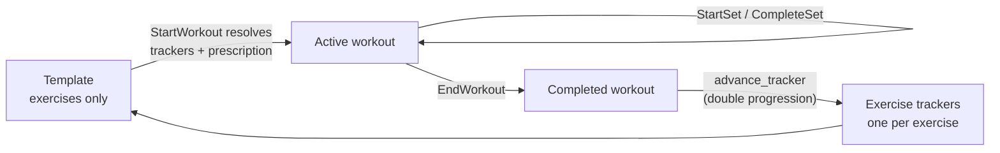
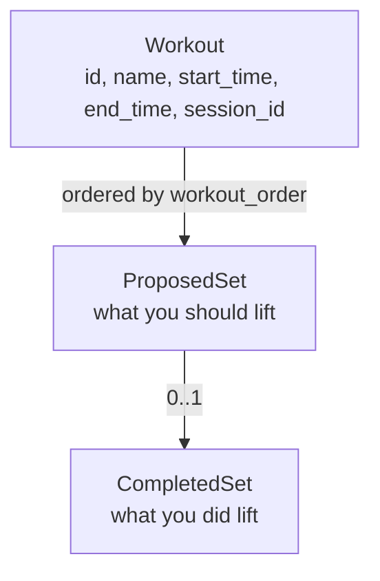
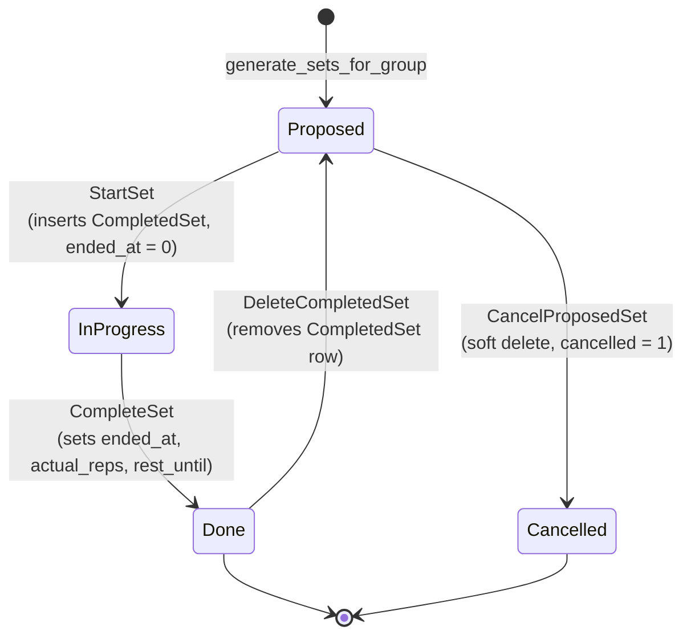
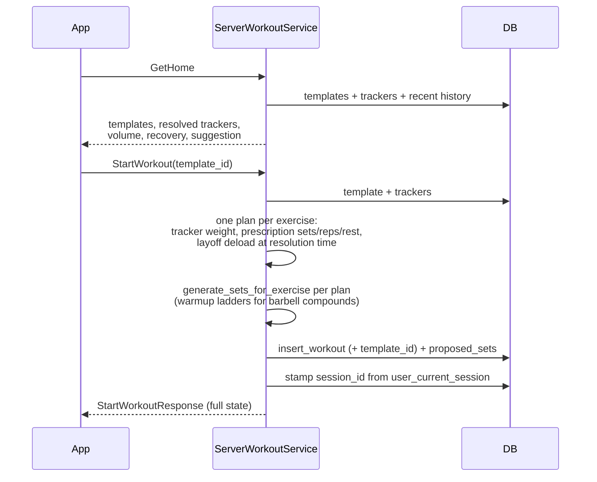
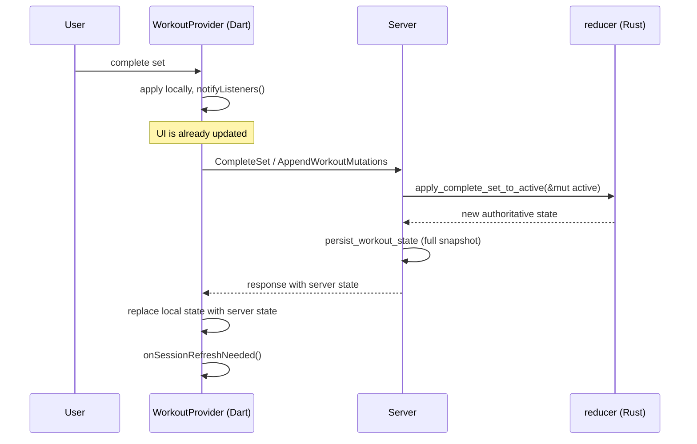
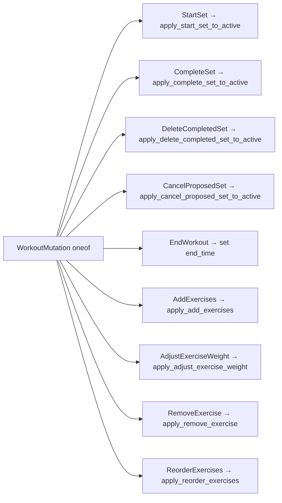
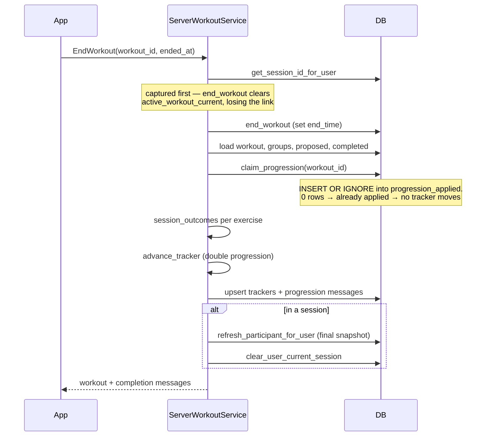

# Workout Lifecycle

This is where most of the system's complexity lives. A workout goes from a
*template* (an ordered exercise list) to an *active workout* (what you're
actually doing) to a *completed workout* (which advances the trackers).

## The loop

The cycle closes on `EndWorkout`: each exercise's outcome advances its
tracker, and the next start from any template resolves the new numbers.

## Objects

A workout is an ordered flat list of `ProposedSet`s; each set carries its
exercise. "The sets for one exercise" is a *derived* block (grouped by
exercise), computed where a card or sheet needs it — never stored. There is
no group or superset structure.

`generate_sets_for_exercise` (`src/workout/planning.rs`) prescribes one
exercise's block: the warmup ladder (where prescribed) then the working
sets.

## Set state machine

A single set moves through these states. There is no status enum — state is
derived from which rows exist and whether their timestamps are zero.

| State | How you detect it |
|---|---|
| Proposed | `ProposedSet` exists, `cancelled = 0`, no matching `CompletedSet` |
| In progress | Matching `CompletedSet` with `ended_at = 0` |
| Done | Matching `CompletedSet` with `ended_at != 0` |
| Cancelled | `ProposedSet.cancelled = 1` |

`StartSet` creating the `CompletedSet` row up front is the non-obvious part: the
row exists before the user has lifted anything, holding only `started_at`.

## Starting a workout

A start with an explicit `exercises` list (the "empty workout" path) runs
through the same prescription; mid-workout changes go through the four
per-exercise ops: `AddExercises`, `AdjustExerciseWeight`, `RemoveExercise`,
`ReorderExercises`.

## Optimistic mutations

The app does not wait for the server to update the UI. `WorkoutProvider` keeps a
local `ActiveWorkout`, applies the same transition the server will apply, and
reconciles when the response lands.

The same logical transition therefore exists **twice**: in Rust
(`src/workout/reducer.rs`) and in Dart (`WorkoutProvider`). They must agree. If
they diverge, the UI flickers as the optimistic result is replaced by a
different server result.

### Batched mutations

`AppendWorkoutMutations` takes a list of mutations and applies them in order —
used when the app has been offline or has queued watch intents.

Each mutation carries a client-generated `event_id` for dedupe and an optional
`client_created_at` so a queued action keeps its original timestamp rather than
the time it was flushed.

After applying mutations the server calls `persist_workout_state`, which writes
the whole workout back rather than diffing. Simple, and it means a partial
failure can't leave half-applied state — at the cost of rewriting every row on
every set.

## Ending a workout

Two ordering constraints worth knowing, both already commented in the source:

1. **Session id is read before `end_workout`**, because ending the workout
   deletes `active_workout_current` and the session link becomes unreachable.
2. **The participant blob is refreshed before leaving the session**, so peers
   still polling see your finished workout rather than a cleared slot.

Progression is idempotent via the `progression_applied` ledger — a retried
`EndWorkout` cannot move a tracker twice. Covered by
`end_workout_is_idempotent` in `src/server/workout_tests.rs` and a fuzz
invariant.

## Crash recovery

There is no event replay. On reconnect the app calls `GetActiveWorkout`, which
looks up `active_workout_current` and reloads the full workout with
`load_workout_full`. State survives because every mutation persists a complete
snapshot.

Every `ProposedSet` field is persisted, so recovery is lossless.

## Where the logic lives

| Concern | File |
|---|---|
| Warmup generation, plate snapping | `src/workout/planning.rs` |
| State transitions | `src/workout/reducer.rs` |
| Next-up-set derivation | `src/progress.rs` |
| Prescription + progression + volume | `src/exercise_catalog.rs`, `src/exercise_progress.rs`, `src/volume.rs` |
| Client-side mirror of all the above | `app/lib/providers/workout_provider.dart`, `app/lib/logic/` |
