# End-to-end scenarios

A single framework for exercising real user journeys against the real stack:
the actual Flutter app running on an Android emulator, talking to a real backend
over gRPC. Every step captures a full-resolution screenshot and a structured log
entry, and the run produces an auditable HTML report.

It replaces the earlier headless widget-test harness, which rendered with missing
fonts and couldn't reach the backend. This one drives the app exactly as a person
would, so what you see in the report is what a user would see.

## Why this shape

- **Real app, real backend.** Scenarios run under Flutter's `integration_test`
  binding via `flutter drive`, on the emulator. Real gRPC round-trips, timers and
  animations resolve naturally — no fake-async, no mocked services.
- **Multiplayer without a second phone.** A scenario is *also* a gRPC client. It
  can log in additional users ("API peers") and drive them through the backend.
  The real app sees them through its normal 1 Hz session polling, because the
  backend can't tell an API peer from another phone. This is the "Model B" from
  the design discussion: one real app instance + API-driven peers.
- **Dev login.** Scenarios authenticate through the app's existing `kDebugMode`
  dev-login field (backed by the `test-auth` backend feature), so no passkey/
  WebAuthn automation is needed.

```mermaid
flowchart LR
  subgraph Host
    D[flutter drive<br/>test_driver/integration_test.dart]
    R[scripts/build_e2e_report.py]
    H[test_screenshots/report.html]
  end
  subgraph Emulator
    A[Real Schlift app]
    S[Scenario<br/>integration_test/*_test.dart]
  end
  B[(Backend<br/>--features test-auth)]

  D -->|installs & runs| S
  S -->|taps, types, screenshots| A
  A -->|gRPC| B
  S -->|API peers: login, join, log sets| B
  S -->|screenshots| D
  S -->|E2E&#124; step log on stdout| D
  D --> R --> H
```



## Running

```bash
make e2e                      # bring up backend+emulator, run every scenario, build report
make e2e SCENARIO=multiplayer # only scenarios whose filename contains "multiplayer"
make e2e-up                   # just bring up backend + emulator + adb reverse
make e2e-run                  # run scenarios (world already up)
```

The report lands at `app/test_screenshots/report.html` (screenshots are embedded,
so it's a single self-contained file).

## The scenarios

| File | What it proves |
| --- | --- |
| `smoke_test.dart` | The app boots on the emulator, reaches the backend, shows login. |
| `solo_onboarding_test.dart` | A new user dev-logs in and is routed to onboarding. |
| `solo_onboarding_full_test.dart` | The whole onboarding flow → a set-up home screen. |
| `solo_workout_test.dart` | Start the proposed workout and log the first set. |
| `multiplayer_peer_test.dart` | An API peer joins; the app shows the 2-person session. |
| `multiplayer_leave_test.dart` | The app tracks a peer joining *and* leaving in real time. |

## Native permission dialogs

Some app paths request OS permissions through native dialogs (Health Connect,
notifications, exact alarms). A native dialog pauses the Flutter surface, which
hangs an integration_test — it can only drive the Flutter view, not system UI.
Scenarios avoid them by opting out of the prompts before launch, via small,
production-safe seams:

- `HealthService.suppressPermissionPrompts = true` — skips the Health Connect
  sheet (bodyweight import, workout tracking). Default false in production.
- `NotificationService.init(requestPermissions: false)` — does the timezone +
  plugin setup rest scheduling needs, without the notification / exact-alarm
  prompts. Production still calls `init()` with prompts on.

`Scenario.launch()` sets both, so scenarios never touch them directly.

## Writing a scenario

A scenario is an `integration_test` widget test that scripts a `Scenario`
(`integration_test/support/scenario.dart`). The `Scenario` wraps the app and
gives you expressive actions plus screenshot + logging:

```dart
testWidgets('solo — new user is routed to onboarding', (tester) async {
  final s = Scenario(binding, tester, 'solo_onboarding');

  await s.launch();                       // pump the real app
  await s.devLogin('alice_${...}');       // dev-login + dismiss passkey notice
  expect(await s.waitForText('Choose your colour and creature'), isTrue);
  await s.shot('Landed on onboarding');   // screenshot + report step
  await s.report();                       // flush the step log
});
```

Key `Scenario` methods:

| Method | Purpose |
| --- | --- |
| `launch()` | Convert the surface (required before capture) and pump the app. |
| `devLogin(name)` | Dev-login and dismiss the one-time passkey notice. |
| `tap(finder)` / `tapText(label)` | Scroll into view, then tap. |
| `typeInto(field, text)` | Focus and enter text. |
| `waitForText(text)` | Poll until text appears (backend round-trips are async). |
| `expectVisible` / `isVisible` | Assert / query on-screen text. |
| `scroll(dy)` | Drag the nearest scrollable. |
| `shot(title, note:)` | Screenshot + record a report step. |
| `note(title, detail:)` | Record a checkpoint with no screenshot. |
| `report()` | Emit the step log (must be the last call). |

### API peers and backend assertions

`s.api` is a gRPC client to the same backend. Use it to drive peers or assert
state:

```dart
final bob = await s.api.login('bob_${...}');   // an API-only user
final aliceToken = /* login as the app user via api to fetch their token */;
await bob.joinViaInvite(await alice.inviteToken());  // pull the app user into a session
```

See `integration_test/support/api.dart` for `Peer` (invite/join, start workout,
complete sets, end workout, leave session).

## How the report survives the run

`integration_test` will deliver **either** screenshots (via `onScreenshot`) **or**
`reportData` back to the driver — never both in one run. And `flutter drive`
uninstalls the app on teardown, wiping any file the app wrote. So the step log
rides the one channel that always survives: **stdout**. `Scenario.report()`
prints one short `E2E|...` line per step; `flutter drive` echoes those into its
log; `run_e2e.sh` tees each scenario's output to `test_screenshots/<name>.drive.log`;
and `build_e2e_report.py` parses the `E2E|` lines and pairs them with the PNGs
that `onScreenshot` wrote.

## Files

| Path | Role |
| --- | --- |
| `app/integration_test/*_test.dart` | Scenarios. |
| `app/integration_test/support/scenario.dart` | The `Scenario` orchestrator. |
| `app/integration_test/support/api.dart` | gRPC `Api` + `Peer` (API peers). |
| `app/test_driver/integration_test.dart` | Host driver — writes screenshots. |
| `scripts/run_e2e.sh` | Runs scenarios, tees logs, builds the report. |
| `scripts/build_e2e_report.py` | Parses `E2E|` lines + PNGs → `report.html`. |
| `make/e2e.mk` | `make e2e` / `e2e-up` / `e2e-run`. |

## Prerequisites

- Android SDK + an `emulator-5554` AVD (`make android-phone-avd-create`).
- The backend builds with the `test-auth` feature (dev login). `make e2e-up`
  starts it via `agent-backend-start`.
- Bundled offline fonts (`app/assets/google_fonts/`) so text renders without a
  network font fetch.
